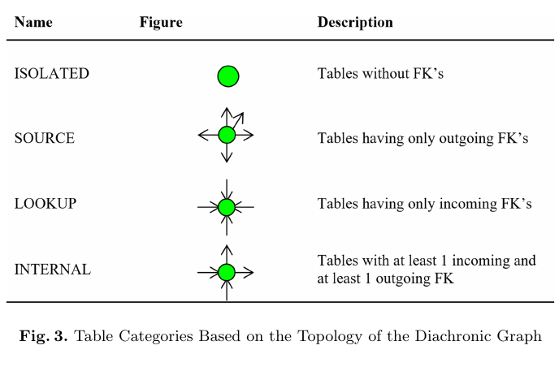

# Tutkimuskysymys

```
Miten skeemaevoluution vaikutuksia voi minimoida tai hallita?
```

# Runko

0. Tiivistelmä
1. Johdanto
	- Mikä on tietokanta?
	- Tietokannan suunnittelu
	- Data warehouse <> data lake, erot, NoSQL
2. Mitä on skeemaevoluutio?
	- Syyt
	- 
	- Mitä se ihan oikeasti on?
	- Pitääkö ottaa kantaa tietokantojen kehitykseen ja Big Datan nousuun?
3. Ratkaisumallit/vaihtoehdot
	- Jätetään tekemättä
4. <jotain vielä>
5. Pohdinta

# Query

SCOPUS:
```
( "schema evolution" ) OR ( "schema drift" ) AND ( LIMIT-TO ( SUBJAREA , "COMP" ) ) AND ( LIMIT-TO ( EXACTKEYWORD , "Etl" ) OR LIMIT-TO ( EXACTKEYWORD , "Extract Transform Loads" ) )
-> 16 results
```


# Lähteet ja lainaukset

---

## Repairing ETL Processes using Extended Relational Algebra
Awiti, J., Wrembel, R. & Zimányi, E. (2025). Repairing ETL Processes using Extended Relational Algebra. Foundations of Computing and Decision Sciences, 50(2), 2025. 157-190. https://doi.org/10.2478/fcds-2025-0006

### !!! p157-158 - ETL prosessin kuvaus
```
A data warehouse (DW) system architecture typically consists of: (1) a data source
(DS) layer, (2) an extract-transform-load (ETL) layer, (3) a repository layer, that is,
a DW or data lake (DL) [50], and (4) an analytical layer. The ETL layer runs the
so-called extract-transform-load (ETL) processes that perform manipulations on data
[1]. ETL processes typically perform the following tasks: (1) extract data from DSs,
which often use different models, (2) transform data into a common model, (3) clean
data by removing missing, inconsistent, and redundant records, and (4) integrate and
load data into a final storage, which is a DW. Notice that similar components are
used for building a data lake architecture [26].
```

### !!! p158 - Mitä skeemaevoluutiossa muuttuu yleensä?
```
Most of the existing ETL tools, both commercial and open source, tacitly assume
that the structure of every DS is static. Such an assumption is often incorrect, as
in reality DSs change their structures (schemas) in time, and these changes may be
frequent. A study of the schema evolution of 195 free open source software projects
[51, 52, 54] with similar schema evolution profiles revealed that only 17% of these
projects had not experienced database schema changes. The rest of the projects had
experienced changes ranging from a few intra-table attribute modifications (33%)
to significant schema changes (11%). Other studies [55, 56] showed that the most
frequent changes in DS schemas include: (1) creating or dropping a table, (2) creating
or dropping an attribute of a table, and (3) changing the definition of an attribute.
Finally, MediaWiki, originally developed to run Wikipedia, had 171 different database
schema versions in 4 years and 7 months of its life [16].
...
In the analysis of schema changes presented in [18], tables were classified in in-
creasing order of complexity as: isolated (not involved in foreign keys), source (with
outgoing foreign keys only), lookup (with incoming foreign keys only), and internal
(with both kinds). The study revealed that less complex tables are more likely to
have a life with few or zero schema updates, whereas more complex tables are more
likely to undergo high numbers of updates. Early versions of the analyzed database
includes the births of complex tables, as opposed to the simple ones, demonstrating
a pattern of reducing the creation of complex, heavily updated tables in the schema
as time progresses.
```

### p158-159 - Miten seurataan datan historiaa ja skeemamuutoksia?
```
A data lineage [2] tool allows a user to monitor where data is coming from, where
data is being transported to, and what transformations are applied to data as it flows
through an ETL process. Some organisations rely on data lineage tools to trace error
in their data pipeline as a result of DS schema changes. A structure lineage provides
means to track dependencies between data objects in a DW/DL system, i.e., between a
DS schema, ETL objects, and a DW schema. Even though data lineage and structure
lineage tools show which part of an ETL process was impacted by a DS change, they
do not provide means for automatic or at least semi-automatic reparation of affected
ETL processes. As a consequence, such repairs have to be done manually.
#### !!! jatkuu - ratkaisuja muuttuviin ETL prosesseihin ei ole vielä kunnolla tarjolla
In practice, large companies deploy dozens or even hundreds of thousands of ETL
processes (e.g., in banking or pharma). Thus, a manual reparation of ETL processes
is complex and costly w.r.t. time and money. Since structural changes in DSs are
frequent, being able to use a solution for an automatic or semi-automatic reparation of
an ETL process after DS schema changes would decrease ETL maintenance time and
cost. Handling and incorporating structural changes to the ETL layer received so far
little attention from the research community [3, 35, 36, 40, 46, 58]. As a consequence,
none of the commercial or open-source ETL tools existing on the market supports
this functionality.
```


---
## Inconsistency-Tolerant Integrity Checking
H. Decker and D. Martinenghi, "Inconsistency-Tolerant Integrity Checking," in IEEE Transactions on Knowledge and Data Engineering, vol. 23, no. 2, pp. 218-234, Feb. 2011, doi: 10.1109/TKDE.2010.87.
keywords: {Database systems;Data mining;Warehousing;Data quality;Transaction databases;Knowledge engineering;Integrity checking;inconsistency tolerance.},

### p218 - Skeemaevoluution syitä - DBMS tuote vaihtuu, joten vaatimukset vaihtuu
```
Integrity violation may sneak into a database in many
ways. For instance, new constraints may be added without
being checked for violations by legacy data. Or, integrity
control may be turned off temporarily, e.g., when uploading
a backup for which a total check would last too long. Or,
integrity may deteriorate by migrating to the DBMS of a
different vendor, since the semantics of integrity constructs
tends to be proprietary. Or, integrity may be compromised
by the integration of databases, when constraints that had
held locally fail to hold after databases have been merged.
```

### p219 - Tutkimuksen tavoitteena on selvittää epäjohdonmukaisuuksia sietävän systeemin ja skeemaevoluution yhdistämistä
```
3. To evaluate the effects of ITIC on database evolution and
query answering. Ultimately, integrity checking is
about preserving the semantics of data through
updates and, consequently, obtaining query answers
that can be trusted. Without total integrity, full
trustability is lost. Yet, some databases may be less
inconsistent than others, and thus better behaved
wrt. query answering. In this paper, we propose a
comprehensive set of experiments for observing the
impact of ITIC on databases subject to evolution
through updates. We report both on the number of
constraint violations and on the number of incorrect
answers to complex benchmark queries. We also
compare our approach to consistent query answer-
ing [1], which is an orthogonal technique for dealing
with inconsistent data.
```

### p228 - ITIC selviää skeemaevoluution tuomista uusista rajoitteista
```
Whenever a new constraint I is added to the integrity
theory, it may be too costly to evaluate it on the spot, let
alone to immediately repair all violated cases of I. As long
as such repairs are delayed, traditional integrity checking is
not applicable, since the total integrity premise does not
hold. However, inconsistency-tolerant integrity checking
can be used, no matter for how long the repair of violated
cases is delayed.
```


---
## A Generic Schema Evolution Approach for NoSQL and Relational Databases
A. H. Chillón, M. Klettke, D. S. Ruiz and J. G. Molina, "A Generic Schema Evolution Approach for NoSQL and Relational Databases," in IEEE Transactions on Knowledge and Data Engineering, vol. 36, no. 7, pp. 2774-2789, July 2024, doi: 10.1109/TKDE.2024.3362273.
keywords: {Data models;Taxonomy;Codes;Databases;Engines;Aggregates;Relational databases;NoSQL databases;schema evolution;Evolution management;taxonomy of changes;schema change operations},


### p2774 Skeemaevoluution yleinen kuvaus ja kommentteja sen ratkaisuista
```
Schema evolution is a classical problem in database research.
Database schemas have to be modified during the
lifetime of databases due to situations such as the appearance
of new functional or non-functional requirements, or database
refactoring. When this happens, stored data and code of database
applications must be updated to conform to the new schema,
as illustrated in Fig. 1. The desirable goal is to automate the
co-evolution of data and code for schema changes in order to
save effort and to avoid data and application errors.
For relational databases, such automation has formally been
addressed in several works that contributed with languages
and tools, among which PRISM++ [1] and DB-Main [2] are
remarkable. More recently, sophisticated commercial tools are
available to support relational schema evolution when agile
development is applied by using continuous integration and
deployment (CI/DC) [3], for example, Liquibase1 and Flyway.
```

### p2774 - NoSQL/data lake skeemaevoluution alaisena myös
```
With the advent of NoSQL stores, automating the schema
evolution of such stores is also attracting great interest [4], [5],
[6], [7]. To provide flexibility, most NoSQL systems do not
require developers to specify a schema declaration, but they are
schema-on-read: no checking against a schema is performed
when data is stored. The “schemaless” term is commonly used
to refer to this characteristic of NoSQL stores. However, not
having to declare a schema does not imply the absence of one.
Instead, it is implicit in data and code, but not specified explicitly.
Data is always stored according to the structure of a schema that
can be formally declared, or live implicit in code and data, with
developers having to write code that manipulates data by having
in mind that schema. Therefore, schema changes also occur for
NoSQL stores, and data and code co-evolution is required.
```

### p2787 - Yksi ratkaisumalli NoSQL skeemaevoluutioon
```
In this paper, we have explored the NoSQL schema evolution
by offering a generic solution: a unified data model with which
we defined a taxonomy of schema changes. We presented the
Orion schema operation language implementing this taxonomy.
Thanks to the richness of the unified metamodel abstractions, we
were able to define changes that affect aggregates, references,
and variations. The operations have been implemented for three
widely used NoSQL stores, one based in documents and schema-
less, other column-based that requires schema declarations, and
a third one based in graphs. The usefulness of our proposal
has been validated through a refactoring of the StackOverflow
dataset and an outlier migration on the Reddit dataset. This work
also presents an application of the unified metamodel presented
by Fernández Candel et al. [9]. An implementation of Athena
and Orion are publicly available on a GitHub repository.9
```


---
## A requirement-driven approach to the design and evolution of data warehouses,
Petar Jovanovic, Oscar Romero, Alkis Simitsis, Alberto Abelló, Daria Mayorova,
A requirement-driven approach to the design and evolution of data warehouses,
Information Systems,
Volume 44,
2014,
Pages 94-119,
ISSN 0306-4379,
https://doi.org/10.1016/j.is.2014.01.004.
(https://www.sciencedirect.com/science/article/pii/S0306437914000222)

```
Abstract: Designing data warehouse (DW) systems in highly dynamic enterprise environments is not an easy task. At each moment, the multidimensional (MD) schema needs to satisfy the set of information requirements posed by the business users. At the same time, the diversity and heterogeneity of the data sources need to be considered in order to properly retrieve needed data. Frequent arrival of new business needs requires that the system is adaptable to changes. To cope with such an inevitable complexity (both at the beginning of the design process and when potential evolution events occur), in this paper we present a semi-automatic method called ORE, for creating DW designs in an iterative fashion based on a given set of information requirements. Requirements are first considered separately. For each requirement, ORE expects the set of possible MD interpretations of the source data needed for that requirement (in a form similar to an MD schema). Incrementally, ORE builds the unified MD schema that satisfies the entire set of requirements and meet some predefined quality objectives. We have implemented ORE and performed a number of experiments to study our approach. We have also conducted a limited-scale case study to investigate its usefulness to designers.
Keywords: DW; ETL; Multidimensional design; Conceptual design
```


### p94 - Miksi muutoksia tapahtuu?
```
Complex business plans and dynamic, evolving enter-
prise environments often result in a continuous flow of new
information requirements that may further require new
analytical perspectives or new data to be analyzed. Due to
the dynamic nature of the DW ecosystem, building the
complete DW design at once is not practical. Also, assuming
that all information and business requirements are available
from the beginning and remain intact is not realistic either.
At the same time, for constructing a DW design (i.e., its MD
schema) the heterogeneity and relations among existing
data sources need to be considered as well.
```

### p94-95 - Kertaluontoisen suunnittelun vaikeus ja ratkaisu siihen, jonkun toisen lähteen mukaan
```
The complexity of the monolithic approach for building a
DW satisfying all information requirements has also been
largely characterized in the literature as a stumbling stone in
DW projects (e.g., see [1]). As a solution to this problem, a step-
by-step approach for building a DW has been proposed in [1]
(a.k.a. Data Warehouse Bus Architecture). This approach starts
from data marts (DM) defined for individual business processes
and continues exploring the common dimensional structures,
which these DMs may possibly share. To facilitate this process,
a matrix as the one shown in Table 1 is used, which relates DMs
(i.e., their subsumed business requirements) to facts and
dimensions implied by each DM. 
```

### Multidimensionaalisen taulukon ja vaatimusten läpikäynti manuaalisesti on iso urakka
```
For example, it has been shown that
even for smaller data source sizes the number of potential
stars produced by means of a blind search of MD patterns
over the sources is huge [7]. Consequently, it is not feasible
to assume that the DW architect will be able to prune and
filter such results manually.
```

### Semiautomaattinne metodi data warehouse vaatimusten mukaisen mallin luomiseen
```
In this work, we present a semi-automatic method for
Ontology-based data warehouse REquirement-driven evo-
lution and integration (ORE). ORE complements the existing
methods (e.g., [5–7]) and assists on semi-automatically
integrating partial MD schemas (each representing a
requirement or a set of requirements) into a unified MD
schema design. Moreover, ORE could also be used to
integrate existing MD schemas of any kind (e.g., as in
[11]). ORE starts from a set of MD interpretations (MDIs)
of individual requirements (which resemble the rows of
Table 1). Intuitively, an MDI is an MD characterization of the
sources that satisfies the requirement at hand (see Section
2.2 for further details). Iteratively, ORE integrates MDIs into
a single MD schema which satisfies all requirements so far.
Importantly, ORE generates MD-compliant results (i.e., ful-
filling the MD integrity constraints) and determines the best
integration options according to a set of quality objectives,
to be defined by the DW designer. To guarantee so, ORE
systematically traces valuable metadata from each integra-
tion iteration. During this entire process, the role of the data
sources is crucial and ORE requires a characterization of the
data sources in terms of a domain ontology, from where to
automatically explore relationships between concepts (e.g.,
synonyms, functional dependencies, taxonomies, etc.) by
means of reasoning.
Our method, ORE, is useful for the early stages of a DW
project, where we need to create an MD schema design
from scratch, but it can also serve during the entire DW
lifecycle to accommodate potential evolution events. As we
discuss later on, in the presence of a new requirement, our
method does not create an MD design from scratch, rather it
can automatically absorb the new requirement and inte-
grate it with the existing MD schema.
```


---
## Still Open Problems in Data Warehouse and Data Lake Research
Robert Wrembel
Poznan University of Technology
Faculty of Computing and Telecommunications
Poznan, Poland
robert.wrembel@put.poznan.pl

### Yhä väitetään ettei ole tutkittu, ainakaan ei ole työkaluja
```
An almost unexplored area for both DW and DL archi-
tectures is the management of structural changes in data
sources at the integration layer (i.e., the ETL/DPW/DPP). In
practice, data sources change their structures (i.e., schemas)
frequently [12], [13]. Typically, after such changes, a pre-
designed and already deployed integration processes cannot
be executed and must be repaired. So far, such a repair is
done manually by an ETL designer, as neither commercial
nor open source integration tools support (semi-)automatic
repairs of such processes. Few solutions to this problem have
been proposed so far, e.g., [14]–[17], but they still require
substantial work from an ETL designer and they are applicable
to simple DS changes and simple data processing workflows
only.
(Semi-)automatic repair of integration processes turned out
to be extremely difficult for traditional (mainly relational) DSs
and it becomes even more difficult in a big data eco-system;
firstly - because big data evolve much more frequently than
traditional data sources, and secondly - because there are many
more data models and formats to be handled while integrating
data.
```

---
## Graceful database schema evolution: the PRISM workbench
Carlo A. Curino, Hyun J. Moon, and Carlo Zaniolo. 2008. Graceful database schema evolution: the PRISM workbench. Proc. VLDB Endow. 1, 1 (August 2008), 761–772. https://doi-org.ezproxy.uef.fi:2443/10.14778/1453856.1453939


### p761 Skeema-muutoksen vaikutuksia
```
Both
practitioners and researchers are well aware that schema
modifications can: (i) dramatically impact both data and
queries [8], endangering the data integrity, (ii) require ex-
pensive application maintenance for queries, and (iii) cause
unacceptable system downtimes. 
```

### p761 Avoimen lähdekoodin web-asiat ovat erityisen alttiita muutoksille
```
The problem is particu-
larly serious in Web Information Systems, such as Wikipedia
[33], where significant downtimes are not acceptable while a
mounting pressure for schema evolution follows from the di-
verse and complex requirements of its open-source, collabo-
rative software-development environment [8].
```


### p762 SMO ja miten PRISM toimii lyhyesti
```
PRISM exploits the concept of Schema Modification
Operators (SMO) [4], representing atomic schema changes,
which we then modify and enhance by (i) introducing the
use of functions for data type and semantic conversions, (ii)
providing a mapping to Disjunctive Embedded Dependen-
cies (DEDs), (iii) obtain invertibility results compatible to
[13], and (iv) define the translation into efficient SQL prim-
itives to perform the data migration.
```


### p771-772 PRISM tarkempi kuvaus, ratkaisu skeemaevoluution hallintaan
```
We presented PRISM, a tool that supports the time-
consuming and error-prone activity of Schema Evolution.
The system provides the DBA with a concise operational
language to represent schema change and increases predictabil-
ity of the evolution being designed by automatically verify-
ing information preservation, redundancy and query sup-
port. The SMO-based representation of the schema evo-
lution is used to derive logical mappings between schema
versions. Legacy queries are thus supported by means of
query rewriting or automatically generated SQL views.
The system provides interfaces with commercial relational
DBMSs to implement the actual data migration and to de-
ploy views and rewritten queries. As a by-product, the
schema evolution history is recorded. This represents an in-
valuable piece of information for the purposes of documenta-
tion, database flash back, and DBA education. Continuous
validation against challenging real-life evolution histories,
such as the one of Wikipedia, proved invaluable in mold-
ing PRISM into a system that builds on the theoretical
foundations laid by recent research and provides a practical
solution to the difficult problems of schema evolution.
```

---
## !!!!!!!!! The data warehouse lifecycle toolkit (2nd ed.)
Kimball, R., & ProQuest. (2008). The data warehouse lifecycle toolkit (2nd ed.). Wiley Pub.,. http://ezproxy.uef.fi:2048/login?url=http://ebookcentral.proquest.com/lib/uef-ebooks/detail.action?docID=675005


### Miksi muutoksia tapahtuu ja miksi se on hyvä merkki?
```
Prepare for Growth and Evolution 
A successful DW/BI system will evolve and grow. If anything, you should constantly be forced to throttle back the requests for new data sources, faster delivery of data, new data mining scores and labels, and new key performance indicators. A changing system is a sign of success, not failure. It indicates your existing business users are asking for more data and BI applications. At the same time, they're spreading the news about the DW/BI system at the grass roots level, so new users will be clamoring for data, tools, and applications. Everyone involved with the DW/BI system from both the business and IT communities should anticipate and appreciate the evolution of the system as it matures. The factors that influenced the early design of your data warehouse—including business sponsorship, users and their requirements, technical architecture, and available source data—are evolving rapidly. The Kimball Lifecycle approach is designed to help the data warehouse respond gracefully to change. Before you think about growth opportunities, you should assess your current environment. If your current system is not successful, we recommend you make adjustments before building anew on the same foundation. Next, develop procedures for prioritizing the many growth opportunities you'll receive. Finally, follow the Kimball Lifecycle from the beginning, adding new content and applications to the DW/BI system.
```
Kimball, Ralph, et al. The Data Warehouse Lifecycle Toolkit, John Wiley & Sons, Incorporated, 2008. ProQuest Ebook Central, http://ebookcentral.proquest.com/lib/uef-ebooks/detail.action?docID=675005.
Created from uef-ebooks on 2026-02-13 09:55:30.


### ETL prosessin tuntemus apuna kehityksessä, MYÖS DATA QUALITY MANAGEMENT ja error event schema
```
The ETL system described in Chapters 9 and 10 and constructed for your first deliverable should be a strong foundation for future development. It's common for second phase projects to have more complex ETL than the initial project. But as an offset, now your ETL developers have tool expertise, and have built the techniques and infrastructure for running the ETL system in your environment. The design we described for data quality tracking is intended to be expanded incrementally. Once the error event schema is in place, then data quality screens can be added one at a time indefinitely. A data quality team should constantly be improving quality by proposing and implementing new and better screens
```
Kimball, Ralph, et al. The Data Warehouse Lifecycle Toolkit, John Wiley & Sons, Incorporated, 2008. ProQuest Ebook Central, http://ebookcentral.proquest.com/lib/uef-ebooks/detail.action?docID=675005.
Created from uef-ebooks on 2026-02-13 09:58:04.


---
## Significance and challenges of big data research
X. Jin, B.W. Wah, X. Cheng, Y. Wang, “Significance and challenges of
big data research”, Big Data Research, 2:(2), 2015, pp. 59–64

## p59-60 - Mitä on big data ja mikä erottaa sen perinteisestä datasta - 5V:tä
```
What is big data? So far, there is no universally accepted def-
inition. In Wikipedia, big data is defined as “an all-encompassing
term for any collection of data sets so large and complex that it
becomes difficult to process using traditional data processing ap-
plications” [8]. From a macro perspective, big data can be regarded
as a bond that subtly connects and integrates the physical world,
the human society, and cyberspace. Here the physical world has a
reflection in cyberspace, embodied as big data, through Internet,
the Internet of Things, and other information technologies, while
human society generates its big data-based mapping in cyberspace
by means of mechanisms like human–computer interfaces, brain–
machine interfaces, and mobile Internet [9–11]. In this sense, big
data can basically be classified into two categories, namely, data
from the physical world, which is usually obtained through sen-
sors, scientific experiments and observations (such as biological
data, neural data, astronomical data, and remote sensing data), and
data from the human society, which is often acquired from such
sources or domains as social networks, Internet, health, finance,
economics, and transportation.
Compared to traditional data, the features of big data can be
characterized by 5V, namely, huge Volume, high Velocity, high
Variety, low Veracity, and high Value. The main difficulty in cop-
ing with big data does not only lie in its huge volume, as we
may alleviate to some extent this issue by reasonably expanding
or extending our computing systems. Actually, the real challenges
center around the diversified data types (Variety), timely response
requirements (Velocity), and uncertainties in the data (Veracity).
Because of the diversified data types, an application often needs
to deal with not only traditional structured data, but also semi-
structured or unstructured data (including text, images, video, and
voice). Timely responses are also challenging because there may
not be enough resources to collect, store, and process the big data
within a reasonable amount of time. Finally, distinguishing be-
tween true and false or reliable and unreliable data is especially
challenging, even for the best data cleaning methods to eliminate
some inherent unpredictability of data.
```


---

## !!!!! A study on the effect of a table’s involvement in foreign keys to its schema evolution
Dimolikas K., Zarras A. V., and Vassiliadis P. A study on the effect of a table’s
involvement in foreign keys to its schema evolution. In International Conference
on Conceptual Modeling ER, volume 12400 of LNCS, pages 456–470. Springer,
2020.

## !!! Minkälaiset taulut muuttuvat useimmiten?
```
A Topological Hierarchy and Its Evolutionary Behavior. After observing
that different topological categories differ in their evolution, we came at an
unexpected finding: there is a hierarchy of topologically increasing complexity
reflected on how tables are evolved by developers of FOSS projects.

Complexity Hierarchy : Isolated → Source −→ Lookup → Internal

We have discovered that the complexity spectrum that results from this hier-
archy relates to the behavior of tables. On the high end of the complexity spec-
trum, the internal tables demonstrate quite a different life than the isolated
tables at the other end of it. Complex internal tables demonstrate high activ-
ity –which means the undergo attribute additions, deletions and type updates–
whereas isolated tables undergo very little if zero change. Remember that we
are studying data sets with hundreds of commits spanning into several years of
monitoring. At the very same time, internal tables are almost totally born at
the earliest version of the database history: in other words, there are no inter-
nal, topologically complex, and, probably active, tables born after the initiation
of the database. The phenomenon is quite opposite for isolated tables: despite
the fact that a fair percentage of them is present in the original version of the
database, isolated tables are the most likely to be added in subsequent versions
```

## !!! Miksi em. löydös toteutuu?
```
Why is this Happening? As also noted in the past [8,12], the main force that
seems to govern schema evolution, at least in the Free Open Source Software
(FOSS) setting that we study, is gravitation to rigidity, due to the difficulty
of altering the schema of a database when surrounding code is built upon it.
The same seems to be observed here too: (a) inactive, topologically simple tables
are much more populous and easy to create than complex and active ones; (b)
very few tables change topological category (Fig. 4), with most changes in the
ephemeral or short-lasting categories of label-changes; (c) different topological
categories seem to have different evolutionary behaviors – specifically, most of
the activity of the high-end of the complexity spectrum is due to the addition of
attributes to the existing structures, quite differently from the lower end of the
spectrum, where administrators are more inclined towards building new tables.
We conjecture that an explanation for this difference in behavior is the avoid-
to-break-the-code principle: adding new information via new tables, which can
later be removed if not useful, does not result in the necessity to update the
surrounding code that queries and updates the existing tables. This leads to
maintenance-by-addition and simplifies the life of developers, at the expense,
of course, of increasing the size of the schema and fragmenting the information
into many tables. So, developers augment the database with simple topologies,
and if complex topologies need expansion, this is done via attribute injection.
A second reason that we conjecture affects the evolutionary profile of tables, is
the deployment of projects. Remember we are studying FOSS projects, built to
be selected by other organizations. Once a FOSS project has been adopted and
deployed by an organization, future upgrades might result in the change of the
schema too. Upgrading the schema in the presence of existing data is a painful
experience, and simple structures and maintenance-by-addition reduce this pain.
```

## Omaa pohdintaa:
```
Näyttäisi siltä, että kehittäjät ovat itsenäisesti "löytäneet" yhden tehokkaan
tavan hallita skeemaevoluution haittavaikutuksia: Mieluiten luodaan uusia pieniä
tauluja tai muutetaan vanhojen taulujen attribuutteja.
```


---
## Self-Adapting Design and Maintenance of Multi-Model Databases
Irena Holubova, Pavel Koupil, and Jiaheng Lu. 2022. Self-Adapting Design and Maintenance of Multi-Model Databases. In Proceedings of the 26th International Database Engineered Applications Symposium (IDEAS '22). Association for Computing Machinery, New York, NY, USA, 9–15. https://doi-org.ezproxy.uef.fi:2443/10.1145/3548785.3548810


---
## An ontological approach to handle multidimensional schema evolution for data warehouse
M. Thenmozhi and K. Vivekanandan, “An ontological approach to handle multidimensional schema
evolution for data warehouse,” International Journal of Database Management Systems, vol. 6, no. 4,
pp. 33–52, 2014.


---

## From Tracking Lineage to Enhancing Data Quality and Auditing: Adding Provenance Support to Data Warehouses
Vieira, M., de Oliveira, T., Cicco, L., de Oliveira, D. and Bedo, M. (2024). From Tracking Lineage to Enhancing Data Quality and Auditing: Adding Provenance Support to Data Warehouses with ProvETL. In Proceedings of the 26th International Conference on Enterprise Information Systems - Volume 1: ICEIS; ISBN 978-989-758-692-7; ISSN 2184-4992, SciTePress, pages 313-320. DOI: 10.5220/0012634500003690

---

## Using semantic web technologies to improve the extract transform load model
Scopus
EXPORT DATE: 11 February 2026

Mahmoud A., Shams M.Y., Elzeki O.M., Awad N.A.
AUTHOR FULL NAMES: Mahmoud, Amena (57221304054); Shams, Mahmoud Y. (57219465762); Elzeki, O.M. (57220855783); Awad, Nancy Awadallah (57221310903)
57221304054; 57219465762; 57220855783; 57221310903
Using semantic web technologies to improve the extract transform load model
(2021) Computers, Materials and Continua, 68 (2), pp. 2711 - 2726, Cited 6 times.
DOI: 10.32604/cmc.2021.015293
https://www.scopus.com/inward/record.uri?eid=2-s2.0-85104877361&doi=10.32604%2fcmc.2021.015293&partnerID=40&md5=bd48682942908652ae7e1b33428689b9

DOCUMENT TYPE: Article
PUBLICATION STAGE: Final
OPEN ACCESS: All Open Access; Gold Open Access
SOURCE: Scopus

---
## Evolution management in multi-model databases
I. Holubová, M. Vavrek, and S. Scherzinger, “Evolution manage-
ment in multi-model databases,” Data Knowl. Eng., vol. 136, 2021,
Art. no. 101932.


---
## The Snowflake Elastic Data Warehouse. 
Benoit Dageville, Thierry Cruanes, Marcin Zukowski, Vadim Antonov, Artin Avanes, Jon Bock, Jonathan Claybaugh, Daniel Engovatov, Martin Hentschel, Jiansheng Huang, Allison W. Lee, Ashish Motivala, Abdul Q. Munir, Steven Pelley, Peter Povinec, Greg Rahn, Spyridon Triantafyllis, and Philipp Unterbrunner. 2016. The Snowflake Elastic Data Warehouse. In Proceedings of the 2016 International Conference on Management of Data (SIGMOD '16). Association for Computing Machinery, New York, NY, USA, 215–226. https://doi-org.ezproxy.uef.fi:2443/10.1145/2882903.2903741


---
## Synchronization of Queries and Views Upon Schema Evolutions: A Survey. 
Loredana Caruccio, Giuseppe Polese, and Genoveffa Tortora. 2016. Synchronization of Queries and Views Upon Schema Evolutions: A Survey. ACM Trans. Database Syst. 41, 2, Article 9 (June 2016), 41 pages. https://doi-org.ezproxy.uef.fi:2443/10.1145/2903726

---
## CODS: evolving data efficiently and scalably in column oriented databases. 
Ziyang Liu, Sivaramakrishnan Natarajan, Bin He, Hui-I Hsiao, and Yi Chen. 2010. CODS: evolving data efficiently and scalably in column oriented databases. Proc. VLDB Endow. 3, 1–2 (September 2010), 1521–1524. https://doi-org.ezproxy.uef.fi:2443/10.14778/1920841.1921028

---
## Schema management for document stores
Schema management for document stores
Author PictureLanjun Wang, Author PictureShuo Zhang, Author PictureJuwei Shi, Author PictureLimei Jiao, Author PictureOktie Hassanzadeh, + 2
Proceedings of the VLDB Endowment (PVLDB), Volume 8, Issue 9Pages 922–933https://doi-org.ezproxy.uef.fi:2443/10.14778/2777598.2777601

---
## Data lake management: challenges and opportunities
Fatemeh Nargesian, Erkang Zhu, Renée J. Miller, Ken Q. Pu, and Patricia C. Arocena. 2019. Data lake management: challenges and opportunities. Proc. VLDB Endow. 12, 12 (August 2019), 1986–1989. https://doi-org.ezproxy.uef.fi:2443/10.14778/3352063.3352116

---
## Knowledge Graph-Enabled Cancer Data Analytics
S. M. S. Hasan, D. Rivera, X. -C. Wu, E. B. Durbin, J. B. Christian and G. Tourassi, "Knowledge Graph-Enabled Cancer Data Analytic# Tutkimuskysymys

```
Miten skeemaevoluution vaikutuksia voi minimoida tai hallita?
```

# Runko

0. Tiivistelmä
1. Johdanto
	- Mikä on tietokanta?
	- Tietokannan suunnittelu
	- Data warehouse <> data lake, erot, NoSQL
2. Mitä on skeemaevoluutio?
	- Syyt
	- 
	- Mitä se ihan oikeasti on?
	- Pitääkö ottaa kantaa tietokantojen kehitykseen ja Big Datan nousuun?
3. Ratkaisumallit/vaihtoehdot
	- Jätetään tekemättä
4. <jotain vielä>
5. Pohdinta

# Query

SCOPUS:
```
( "schema evolution" ) OR ( "schema drift" ) AND ( LIMIT-TO ( SUBJAREA , "COMP" ) ) AND ( LIMIT-TO ( EXACTKEYWORD , "Etl" ) OR LIMIT-TO ( EXACTKEYWORD , "Extract Transform Loads" ) )
-> 16 results
```


# Lähteet ja lainaukset

---

## Repairing ETL Processes using Extended Relational Algebra
Awiti, J., Wrembel, R. & Zimányi, E. (2025). Repairing ETL Processes using Extended Relational Algebra. Foundations of Computing and Decision Sciences, 50(2), 2025. 157-190. https://doi.org/10.2478/fcds-2025-0006

### !!! p157-158 - ETL prosessin kuvaus
```
A data warehouse (DW) system architecture typically consists of: (1) a data source
(DS) layer, (2) an extract-transform-load (ETL) layer, (3) a repository layer, that is,
a DW or data lake (DL) [50], and (4) an analytical layer. The ETL layer runs the
so-called extract-transform-load (ETL) processes that perform manipulations on data
[1]. ETL processes typically perform the following tasks: (1) extract data from DSs,
which often use different models, (2) transform data into a common model, (3) clean
data by removing missing, inconsistent, and redundant records, and (4) integrate and
load data into a final storage, which is a DW. Notice that similar components are
used for building a data lake architecture [26].
```

### !!! p158 - Mitä skeemaevoluutiossa muuttuu yleensä?
```
Most of the existing ETL tools, both commercial and open source, tacitly assume
that the structure of every DS is static. Such an assumption is often incorrect, as
in reality DSs change their structures (schemas) in time, and these changes may be
frequent. A study of the schema evolution of 195 free open source software projects
[51, 52, 54] with similar schema evolution profiles revealed that only 17% of these
projects had not experienced database schema changes. The rest of the projects had
experienced changes ranging from a few intra-table attribute modifications (33%)
to significant schema changes (11%). Other studies [55, 56] showed that the most
frequent changes in DS schemas include: (1) creating or dropping a table, (2) creating
or dropping an attribute of a table, and (3) changing the definition of an attribute.
Finally, MediaWiki, originally developed to run Wikipedia, had 171 different database
schema versions in 4 years and 7 months of its life [16].
...
In the analysis of schema changes presented in [18], tables were classified in in-
creasing order of complexity as: isolated (not involved in foreign keys), source (with
outgoing foreign keys only), lookup (with incoming foreign keys only), and internal
(with both kinds). The study revealed that less complex tables are more likely to
have a life with few or zero schema updates, whereas more complex tables are more
likely to undergo high numbers of updates. Early versions of the analyzed database
includes the births of complex tables, as opposed to the simple ones, demonstrating
a pattern of reducing the creation of complex, heavily updated tables in the schema
as time progresses.
```

### p158-159 - Miten seurataan datan historiaa ja skeemamuutoksia?
```
A data lineage [2] tool allows a user to monitor where data is coming from, where
data is being transported to, and what transformations are applied to data as it flows
through an ETL process. Some organisations rely on data lineage tools to trace error
in their data pipeline as a result of DS schema changes. A structure lineage provides
means to track dependencies between data objects in a DW/DL system, i.e., between a
DS schema, ETL objects, and a DW schema. Even though data lineage and structure
lineage tools show which part of an ETL process was impacted by a DS change, they
do not provide means for automatic or at least semi-automatic reparation of affected
ETL processes. As a consequence, such repairs have to be done manually.
#### !!! jatkuu - ratkaisuja muuttuviin ETL prosesseihin ei ole vielä kunnolla tarjolla
In practice, large companies deploy dozens or even hundreds of thousands of ETL
processes (e.g., in banking or pharma). Thus, a manual reparation of ETL processes
is complex and costly w.r.t. time and money. Since structural changes in DSs are
frequent, being able to use a solution for an automatic or semi-automatic reparation of
an ETL process after DS schema changes would decrease ETL maintenance time and
cost. Handling and incorporating structural changes to the ETL layer received so far
little attention from the research community [3, 35, 36, 40, 46, 58]. As a consequence,
none of the commercial or open-source ETL tools existing on the market supports
this functionality.
```


---
## Inconsistency-Tolerant Integrity Checking
H. Decker and D. Martinenghi, "Inconsistency-Tolerant Integrity Checking," in IEEE Transactions on Knowledge and Data Engineering, vol. 23, no. 2, pp. 218-234, Feb. 2011, doi: 10.1109/TKDE.2010.87.
keywords: {Database systems;Data mining;Warehousing;Data quality;Transaction databases;Knowledge engineering;Integrity checking;inconsistency tolerance.},

### p218 - Skeemaevoluution syitä - DBMS tuote vaihtuu, joten vaatimukset vaihtuu
```
Integrity violation may sneak into a database in many
ways. For instance, new constraints may be added without
being checked for violations by legacy data. Or, integrity
control may be turned off temporarily, e.g., when uploading
a backup for which a total check would last too long. Or,
integrity may deteriorate by migrating to the DBMS of a
different vendor, since the semantics of integrity constructs
tends to be proprietary. Or, integrity may be compromised
by the integration of databases, when constraints that had
held locally fail to hold after databases have been merged.
```

### p219 - Tutkimuksen tavoitteena on selvittää epäjohdonmukaisuuksia sietävän systeemin ja skeemaevoluution yhdistämistä
```
3. To evaluate the effects of ITIC on database evolution and
query answering. Ultimately, integrity checking is
about preserving the semantics of data through
updates and, consequently, obtaining query answers
that can be trusted. Without total integrity, full
trustability is lost. Yet, some databases may be less
inconsistent than others, and thus better behaved
wrt. query answering. In this paper, we propose a
comprehensive set of experiments for observing the
impact of ITIC on databases subject to evolution
through updates. We report both on the number of
constraint violations and on the number of incorrect
answers to complex benchmark queries. We also
compare our approach to consistent query answer-
ing [1], which is an orthogonal technique for dealing
with inconsistent data.
```

### p228 - ITIC selviää skeemaevoluution tuomista uusista rajoitteista
```
Whenever a new constraint I is added to the integrity
theory, it may be too costly to evaluate it on the spot, let
alone to immediately repair all violated cases of I. As long
as such repairs are delayed, traditional integrity checking is
not applicable, since the total integrity premise does not
hold. However, inconsistency-tolerant integrity checking
can be used, no matter for how long the repair of violated
cases is delayed.
```


---
## A Generic Schema Evolution Approach for NoSQL and Relational Databases
A. H. Chillón, M. Klettke, D. S. Ruiz and J. G. Molina, "A Generic Schema Evolution Approach for NoSQL and Relational Databases," in IEEE Transactions on Knowledge and Data Engineering, vol. 36, no. 7, pp. 2774-2789, July 2024, doi: 10.1109/TKDE.2024.3362273.
keywords: {Data models;Taxonomy;Codes;Databases;Engines;Aggregates;Relational databases;NoSQL databases;schema evolution;Evolution management;taxonomy of changes;schema change operations},


### p2774 Skeemaevoluution yleinen kuvaus ja kommentteja sen ratkaisuista
```
Schema evolution is a classical problem in database research.
Database schemas have to be modified during the
lifetime of databases due to situations such as the appearance
of new functional or non-functional requirements, or database
refactoring. When this happens, stored data and code of database
applications must be updated to conform to the new schema,
as illustrated in Fig. 1. The desirable goal is to automate the
co-evolution of data and code for schema changes in order to
save effort and to avoid data and application errors.
For relational databases, such automation has formally been
addressed in several works that contributed with languages
and tools, among which PRISM++ [1] and DB-Main [2] are
remarkable. More recently, sophisticated commercial tools are
available to support relational schema evolution when agile
development is applied by using continuous integration and
deployment (CI/DC) [3], for example, Liquibase1 and Flyway.
```

### p2774 - NoSQL/data lake skeemaevoluution alaisena myös
```
With the advent of NoSQL stores, automating the schema
evolution of such stores is also attracting great interest [4], [5],
[6], [7]. To provide flexibility, most NoSQL systems do not
require developers to specify a schema declaration, but they are
schema-on-read: no checking against a schema is performed
when data is stored. The “schemaless” term is commonly used
to refer to this characteristic of NoSQL stores. However, not
having to declare a schema does not imply the absence of one.
Instead, it is implicit in data and code, but not specified explicitly.
Data is always stored according to the structure of a schema that
can be formally declared, or live implicit in code and data, with
developers having to write code that manipulates data by having
in mind that schema. Therefore, schema changes also occur for
NoSQL stores, and data and code co-evolution is required.
```

### p2787 - Yksi ratkaisumalli NoSQL skeemaevoluutioon
```
In this paper, we have explored the NoSQL schema evolution
by offering a generic solution: a unified data model with which
we defined a taxonomy of schema changes. We presented the
Orion schema operation language implementing this taxonomy.
Thanks to the richness of the unified metamodel abstractions, we
were able to define changes that affect aggregates, references,
and variations. The operations have been implemented for three
widely used NoSQL stores, one based in documents and schema-
less, other column-based that requires schema declarations, and
a third one based in graphs. The usefulness of our proposal
has been validated through a refactoring of the StackOverflow
dataset and an outlier migration on the Reddit dataset. This work
also presents an application of the unified metamodel presented
by Fernández Candel et al. [9]. An implementation of Athena
and Orion are publicly available on a GitHub repository.9
```


---
## A requirement-driven approach to the design and evolution of data warehouses,
Petar Jovanovic, Oscar Romero, Alkis Simitsis, Alberto Abelló, Daria Mayorova,
A requirement-driven approach to the design and evolution of data warehouses,
Information Systems,
Volume 44,
2014,
Pages 94-119,
ISSN 0306-4379,
https://doi.org/10.1016/j.is.2014.01.004.
(https://www.sciencedirect.com/science/article/pii/S0306437914000222)

```
Abstract: Designing data warehouse (DW) systems in highly dynamic enterprise environments is not an easy task. At each moment, the multidimensional (MD) schema needs to satisfy the set of information requirements posed by the business users. At the same time, the diversity and heterogeneity of the data sources need to be considered in order to properly retrieve needed data. Frequent arrival of new business needs requires that the system is adaptable to changes. To cope with such an inevitable complexity (both at the beginning of the design process and when potential evolution events occur), in this paper we present a semi-automatic method called ORE, for creating DW designs in an iterative fashion based on a given set of information requirements. Requirements are first considered separately. For each requirement, ORE expects the set of possible MD interpretations of the source data needed for that requirement (in a form similar to an MD schema). Incrementally, ORE builds the unified MD schema that satisfies the entire set of requirements and meet some predefined quality objectives. We have implemented ORE and performed a number of experiments to study our approach. We have also conducted a limited-scale case study to investigate its usefulness to designers.
Keywords: DW; ETL; Multidimensional design; Conceptual design
```


### p94 - Miksi muutoksia tapahtuu?
```
Complex business plans and dynamic, evolving enter-
prise environments often result in a continuous flow of new
information requirements that may further require new
analytical perspectives or new data to be analyzed. Due to
the dynamic nature of the DW ecosystem, building the
complete DW design at once is not practical. Also, assuming
that all information and business requirements are available
from the beginning and remain intact is not realistic either.
At the same time, for constructing a DW design (i.e., its MD
schema) the heterogeneity and relations among existing
data sources need to be considered as well.
```

### p94-95 - Kertaluontoisen suunnittelun vaikeus ja ratkaisu siihen, jonkun toisen lähteen mukaan
```
The complexity of the monolithic approach for building a
DW satisfying all information requirements has also been
largely characterized in the literature as a stumbling stone in
DW projects (e.g., see [1]). As a solution to this problem, a step-
by-step approach for building a DW has been proposed in [1]
(a.k.a. Data Warehouse Bus Architecture). This approach starts
from data marts (DM) defined for individual business processes
and continues exploring the common dimensional structures,
which these DMs may possibly share. To facilitate this process,
a matrix as the one shown in Table 1 is used, which relates DMs
(i.e., their subsumed business requirements) to facts and
dimensions implied by each DM. 
```

### Multidimensionaalisen taulukon ja vaatimusten läpikäynti manuaalisesti on iso urakka
```
For example, it has been shown that
even for smaller data source sizes the number of potential
stars produced by means of a blind search of MD patterns
over the sources is huge [7]. Consequently, it is not feasible
to assume that the DW architect will be able to prune and
filter such results manually.
```

### Semiautomaattinne metodi data warehouse vaatimusten mukaisen mallin luomiseen
```
In this work, we present a semi-automatic method for
Ontology-based data warehouse REquirement-driven evo-
lution and integration (ORE). ORE complements the existing
methods (e.g., [5–7]) and assists on semi-automatically
integrating partial MD schemas (each representing a
requirement or a set of requirements) into a unified MD
schema design. Moreover, ORE could also be used to
integrate existing MD schemas of any kind (e.g., as in
[11]). ORE starts from a set of MD interpretations (MDIs)
of individual requirements (which resemble the rows of
Table 1). Intuitively, an MDI is an MD characterization of the
sources that satisfies the requirement at hand (see Section
2.2 for further details). Iteratively, ORE integrates MDIs into
a single MD schema which satisfies all requirements so far.
Importantly, ORE generates MD-compliant results (i.e., ful-
filling the MD integrity constraints) and determines the best
integration options according to a set of quality objectives,
to be defined by the DW designer. To guarantee so, ORE
systematically traces valuable metadata from each integra-
tion iteration. During this entire process, the role of the data
sources is crucial and ORE requires a characterization of the
data sources in terms of a domain ontology, from where to
automatically explore relationships between concepts (e.g.,
synonyms, functional dependencies, taxonomies, etc.) by
means of reasoning.
Our method, ORE, is useful for the early stages of a DW
project, where we need to create an MD schema design
from scratch, but it can also serve during the entire DW
lifecycle to accommodate potential evolution events. As we
discuss later on, in the presence of a new requirement, our
method does not create an MD design from scratch, rather it
can automatically absorb the new requirement and inte-
grate it with the existing MD schema.
```


---
## Still Open Problems in Data Warehouse and Data Lake Research
Robert Wrembel
Poznan University of Technology
Faculty of Computing and Telecommunications
Poznan, Poland
robert.wrembel@put.poznan.pl

### Yhä väitetään ettei ole tutkittu, ainakaan ei ole työkaluja
```
An almost unexplored area for both DW and DL archi-
tectures is the management of structural changes in data
sources at the integration layer (i.e., the ETL/DPW/DPP). In
practice, data sources change their structures (i.e., schemas)
frequently [12], [13]. Typically, after such changes, a pre-
designed and already deployed integration processes cannot
be executed and must be repaired. So far, such a repair is
done manually by an ETL designer, as neither commercial
nor open source integration tools support (semi-)automatic
repairs of such processes. Few solutions to this problem have
been proposed so far, e.g., [14]–[17], but they still require
substantial work from an ETL designer and they are applicable
to simple DS changes and simple data processing workflows
only.
(Semi-)automatic repair of integration processes turned out
to be extremely difficult for traditional (mainly relational) DSs
and it becomes even more difficult in a big data eco-system;
firstly - because big data evolve much more frequently than
traditional data sources, and secondly - because there are many
more data models and formats to be handled while integrating
data.
```

---
## Graceful database schema evolution: the PRISM workbench
Carlo A. Curino, Hyun J. Moon, and Carlo Zaniolo. 2008. Graceful database schema evolution: the PRISM workbench. Proc. VLDB Endow. 1, 1 (August 2008), 761–772. https://doi-org.ezproxy.uef.fi:2443/10.14778/1453856.1453939


### p761 Skeema-muutoksen vaikutuksia
```
Both
practitioners and researchers are well aware that schema
modifications can: (i) dramatically impact both data and
queries [8], endangering the data integrity, (ii) require ex-
pensive application maintenance for queries, and (iii) cause
unacceptable system downtimes. 
```

### p761 Avoimen lähdekoodin web-asiat ovat erityisen alttiita muutoksille
```
The problem is particu-
larly serious in Web Information Systems, such as Wikipedia
[33], where significant downtimes are not acceptable while a
mounting pressure for schema evolution follows from the di-
verse and complex requirements of its open-source, collabo-
rative software-development environment [8].
```


### p762 SMO ja miten PRISM toimii lyhyesti
```
PRISM exploits the concept of Schema Modification
Operators (SMO) [4], representing atomic schema changes,
which we then modify and enhance by (i) introducing the
use of functions for data type and semantic conversions, (ii)
providing a mapping to Disjunctive Embedded Dependen-
cies (DEDs), (iii) obtain invertibility results compatible to
[13], and (iv) define the translation into efficient SQL prim-
itives to perform the data migration.
```


### p771-772 PRISM tarkempi kuvaus, ratkaisu skeemaevoluution hallintaan
```
We presented PRISM, a tool that supports the time-
consuming and error-prone activity of Schema Evolution.
The system provides the DBA with a concise operational
language to represent schema change and increases predictabil-
ity of the evolution being designed by automatically verify-
ing information preservation, redundancy and query sup-
port. The SMO-based representation of the schema evo-
lution is used to derive logical mappings between schema
versions. Legacy queries are thus supported by means of
query rewriting or automatically generated SQL views.
The system provides interfaces with commercial relational
DBMSs to implement the actual data migration and to de-
ploy views and rewritten queries. As a by-product, the
schema evolution history is recorded. This represents an in-
valuable piece of information for the purposes of documenta-
tion, database flash back, and DBA education. Continuous
validation against challenging real-life evolution histories,
such as the one of Wikipedia, proved invaluable in mold-
ing PRISM into a system that builds on the theoretical
foundations laid by recent research and provides a practical
solution to the difficult problems of schema evolution.
```

---
## !!!!!!!!! The data warehouse lifecycle toolkit (2nd ed.)
Kimball, R., & ProQuest. (2008). The data warehouse lifecycle toolkit (2nd ed.). Wiley Pub.,. http://ezproxy.uef.fi:2048/login?url=http://ebookcentral.proquest.com/lib/uef-ebooks/detail.action?docID=675005


### Miksi muutoksia tapahtuu ja miksi se on hyvä merkki?
```
Prepare for Growth and Evolution 
A successful DW/BI system will evolve and grow. If anything, you should constantly be forced to throttle back the requests for new data sources, faster delivery of data, new data mining scores and labels, and new key performance indicators. A changing system is a sign of success, not failure. It indicates your existing business users are asking for more data and BI applications. At the same time, they're spreading the news about the DW/BI system at the grass roots level, so new users will be clamoring for data, tools, and applications. Everyone involved with the DW/BI system from both the business and IT communities should anticipate and appreciate the evolution of the system as it matures. The factors that influenced the early design of your data warehouse—including business sponsorship, users and their requirements, technical architecture, and available source data—are evolving rapidly. The Kimball Lifecycle approach is designed to help the data warehouse respond gracefully to change. Before you think about growth opportunities, you should assess your current environment. If your current system is not successful, we recommend you make adjustments before building anew on the same foundation. Next, develop procedures for prioritizing the many growth opportunities you'll receive. Finally, follow the Kimball Lifecycle from the beginning, adding new content and applications to the DW/BI system.
```
Kimball, Ralph, et al. The Data Warehouse Lifecycle Toolkit, John Wiley & Sons, Incorporated, 2008. ProQuest Ebook Central, http://ebookcentral.proquest.com/lib/uef-ebooks/detail.action?docID=675005.
Created from uef-ebooks on 2026-02-13 09:55:30.


### ETL prosessin tuntemus apuna kehityksessä, MYÖS DATA QUALITY MANAGEMENT ja error event schema
```
The ETL system described in Chapters 9 and 10 and constructed for your first deliverable should be a strong foundation for future development. It's common for second phase projects to have more complex ETL than the initial project. But as an offset, now your ETL developers have tool expertise, and have built the techniques and infrastructure for running the ETL system in your environment. The design we described for data quality tracking is intended to be expanded incrementally. Once the error event schema is in place, then data quality screens can be added one at a time indefinitely. A data quality team should constantly be improving quality by proposing and implementing new and better screens
```
Kimball, Ralph, et al. The Data Warehouse Lifecycle Toolkit, John Wiley & Sons, Incorporated, 2008. ProQuest Ebook Central, http://ebookcentral.proquest.com/lib/uef-ebooks/detail.action?docID=675005.
Created from uef-ebooks on 2026-02-13 09:58:04.


---
## Significance and challenges of big data research
X. Jin, B.W. Wah, X. Cheng, Y. Wang, “Significance and challenges of
big data research”, Big Data Research, 2:(2), 2015, pp. 59–64

## p59-60 - Mitä on big data ja mikä erottaa sen perinteisestä datasta - 5V:tä
```
What is big data? So far, there is no universally accepted def-
inition. In Wikipedia, big data is defined as “an all-encompassing
term for any collection of data sets so large and complex that it
becomes difficult to process using traditional data processing ap-
plications” [8]. From a macro perspective, big data can be regarded
as a bond that subtly connects and integrates the physical world,
the human society, and cyberspace. Here the physical world has a
reflection in cyberspace, embodied as big data, through Internet,
the Internet of Things, and other information technologies, while
human society generates its big data-based mapping in cyberspace
by means of mechanisms like human–computer interfaces, brain–
machine interfaces, and mobile Internet [9–11]. In this sense, big
data can basically be classified into two categories, namely, data
from the physical world, which is usually obtained through sen-
sors, scientific experiments and observations (such as biological
data, neural data, astronomical data, and remote sensing data), and
data from the human society, which is often acquired from such
sources or domains as social networks, Internet, health, finance,
economics, and transportation.
Compared to traditional data, the features of big data can be
characterized by 5V, namely, huge Volume, high Velocity, high
Variety, low Veracity, and high Value. The main difficulty in cop-
ing with big data does not only lie in its huge volume, as we
may alleviate to some extent this issue by reasonably expanding
or extending our computing systems. Actually, the real challenges
center around the diversified data types (Variety), timely response
requirements (Velocity), and uncertainties in the data (Veracity).
Because of the diversified data types, an application often needs
to deal with not only traditional structured data, but also semi-
structured or unstructured data (including text, images, video, and
voice). Timely responses are also challenging because there may
not be enough resources to collect, store, and process the big data
within a reasonable amount of time. Finally, distinguishing be-
tween true and false or reliable and unreliable data is especially
challenging, even for the best data cleaning methods to eliminate
some inherent unpredictability of data.
```


---

## !!!!! A study on the effect of a table’s involvement in foreign keys to its schema evolution
Dimolikas K., Zarras A. V., and Vassiliadis P. A study on the effect of a table’s
involvement in foreign keys to its schema evolution. In International Conference
on Conceptual Modeling ER, volume 12400 of LNCS, pages 456–470. Springer,
2020.

## !!! Minkälaiset taulut muuttuvat useimmiten?



```
A Topological Hierarchy and Its Evolutionary Behavior. After observing
that different topological categories differ in their evolution, we came at an
unexpected finding: there is a hierarchy of topologically increasing complexity
reflected on how tables are evolved by developers of FOSS projects.

Complexity Hierarchy : Isolated → Source −→ Lookup → Internal

We have discovered that the complexity spectrum that results from this hier-
archy relates to the behavior of tables. On the high end of the complexity spec-
trum, the internal tables demonstrate quite a different life than the isolated
tables at the other end of it. Complex internal tables demonstrate high activ-
ity –which means the undergo attribute additions, deletions and type updates–
whereas isolated tables undergo very little if zero change. Remember that we
are studying data sets with hundreds of commits spanning into several years of
monitoring. At the very same time, internal tables are almost totally born at
the earliest version of the database history: in other words, there are no inter-
nal, topologically complex, and, probably active, tables born after the initiation
of the database. The phenomenon is quite opposite for isolated tables: despite
the fact that a fair percentage of them is present in the original version of the
database, isolated tables are the most likely to be added in subsequent versions
```

## !!! Miksi em. löydös toteutuu?
```
Why is this Happening? As also noted in the past [8,12], the main force that
seems to govern schema evolution, at least in the Free Open Source Software
(FOSS) setting that we study, is gravitation to rigidity, due to the difficulty
of altering the schema of a database when surrounding code is built upon it.
The same seems to be observed here too: (a) inactive, topologically simple tables
are much more populous and easy to create than complex and active ones; (b)
very few tables change topological category (Fig. 4), with most changes in the
ephemeral or short-lasting categories of label-changes; (c) different topological
categories seem to have different evolutionary behaviors – specifically, most of
the activity of the high-end of the complexity spectrum is due to the addition of
attributes to the existing structures, quite differently from the lower end of the
spectrum, where administrators are more inclined towards building new tables.
We conjecture that an explanation for this difference in behavior is the avoid-
to-break-the-code principle: adding new information via new tables, which can
later be removed if not useful, does not result in the necessity to update the
surrounding code that queries and updates the existing tables. This leads to
maintenance-by-addition and simplifies the life of developers, at the expense,
of course, of increasing the size of the schema and fragmenting the information
into many tables. So, developers augment the database with simple topologies,
and if complex topologies need expansion, this is done via attribute injection.
A second reason that we conjecture affects the evolutionary profile of tables, is
the deployment of projects. Remember we are studying FOSS projects, built to
be selected by other organizations. Once a FOSS project has been adopted and
deployed by an organization, future upgrades might result in the change of the
schema too. Upgrading the schema in the presence of existing data is a painful
experience, and simple structures and maintenance-by-addition reduce this pain.
```

## Omaa pohdintaa:
```
Näyttäisi siltä, että kehittäjät ovat itsenäisesti "löytäneet" yhden tehokkaan
tavan hallita skeemaevoluution haittavaikutuksia: Mieluiten luodaan uusia pieniä
tauluja tai muutetaan vanhojen taulujen attribuutteja.
```


---
## An Empirical Study on the Design and Evolution of NoSQL Database Schemas

Scherzinger S., Sidortschuck S.
AUTHOR FULL NAMES: Scherzinger, Stefanie (16317498000); Sidortschuck, Sebastian (57219496414)
16317498000; 57219496414
An Empirical Study on the Design and Evolution of NoSQL Database Schemas
(2020) Lecture Notes in Computer Science (including subseries Lecture Notes in Artificial Intelligence and Lecture Notes in Bioinformatics), 12400 LNCS, pp. 441 - 455, Cited 24 times.
DOI: 10.1007/978-3-030-62522-1_33
https://www.scopus.com/inward/record.uri?eid=2-s2.0-85097385437&doi=10.1007%2f978-3-030-62522-1_33&partnerID=40&md5=fe3ab45031fe101795700c8dad786e5c

DOCUMENT TYPE: Conference paper
PUBLICATION STAGE: Final
OPEN ACCESS: All Open Access; Green Open Access
SOURCE: Scopus


---
## Self-Adapting Design and Maintenance of Multi-Model Databases
Irena Holubova, Pavel Koupil, and Jiaheng Lu. 2022. Self-Adapting Design and Maintenance of Multi-Model Databases. In Proceedings of the 26th International Database Engineered Applications Symposium (IDEAS '22). Association for Computing Machinery, New York, NY, USA, 9–15. https://doi-org.ezproxy.uef.fi:2443/10.1145/3548785.3548810


---
## An ontological approach to handle multidimensional schema evolution for data warehouse
M. Thenmozhi and K. Vivekanandan, “An ontological approach to handle multidimensional schema
evolution for data warehouse,” International Journal of Database Management Systems, vol. 6, no. 4,
pp. 33–52, 2014.


---

## From Tracking Lineage to Enhancing Data Quality and Auditing: Adding Provenance Support to Data Warehouses
Vieira, M., de Oliveira, T., Cicco, L., de Oliveira, D. and Bedo, M. (2024). From Tracking Lineage to Enhancing Data Quality and Auditing: Adding Provenance Support to Data Warehouses with ProvETL. In Proceedings of the 26th International Conference on Enterprise Information Systems - Volume 1: ICEIS; ISBN 978-989-758-692-7; ISSN 2184-4992, SciTePress, pages 313-320. DOI: 10.5220/0012634500003690

---

## Using semantic web technologies to improve the extract transform load model
Scopus
EXPORT DATE: 11 February 2026

Mahmoud A., Shams M.Y., Elzeki O.M., Awad N.A.
AUTHOR FULL NAMES: Mahmoud, Amena (57221304054); Shams, Mahmoud Y. (57219465762); Elzeki, O.M. (57220855783); Awad, Nancy Awadallah (57221310903)
57221304054; 57219465762; 57220855783; 57221310903
Using semantic web technologies to improve the extract transform load model
(2021) Computers, Materials and Continua, 68 (2), pp. 2711 - 2726, Cited 6 times.
DOI: 10.32604/cmc.2021.015293
https://www.scopus.com/inward/record.uri?eid=2-s2.0-85104877361&doi=10.32604%2fcmc.2021.015293&partnerID=40&md5=bd48682942908652ae7e1b33428689b9

DOCUMENT TYPE: Article
PUBLICATION STAGE: Final
OPEN ACCESS: All Open Access; Gold Open Access
SOURCE: Scopus

---
## Evolution management in multi-model databases
I. Holubová, M. Vavrek, and S. Scherzinger, “Evolution manage-
ment in multi-model databases,” Data Knowl. Eng., vol. 136, 2021,
Art. no. 101932.


---
## The Snowflake Elastic Data Warehouse. 
Benoit Dageville, Thierry Cruanes, Marcin Zukowski, Vadim Antonov, Artin Avanes, Jon Bock, Jonathan Claybaugh, Daniel Engovatov, Martin Hentschel, Jiansheng Huang, Allison W. Lee, Ashish Motivala, Abdul Q. Munir, Steven Pelley, Peter Povinec, Greg Rahn, Spyridon Triantafyllis, and Philipp Unterbrunner. 2016. The Snowflake Elastic Data Warehouse. In Proceedings of the 2016 International Conference on Management of Data (SIGMOD '16). Association for Computing Machinery, New York, NY, USA, 215–226. https://doi-org.ezproxy.uef.fi:2443/10.1145/2882903.2903741


---
## Synchronization of Queries and Views Upon Schema Evolutions: A Survey. 
Loredana Caruccio, Giuseppe Polese, and Genoveffa Tortora. 2016. Synchronization of Queries and Views Upon Schema Evolutions: A Survey. ACM Trans. Database Syst. 41, 2, Article 9 (June 2016), 41 pages. https://doi-org.ezproxy.uef.fi:2443/10.1145/2903726

---
## CODS: evolving data efficiently and scalably in column oriented databases. 
Ziyang Liu, Sivaramakrishnan Natarajan, Bin He, Hui-I Hsiao, and Yi Chen. 2010. CODS: evolving data efficiently and scalably in column oriented databases. Proc. VLDB Endow. 3, 1–2 (September 2010), 1521–1524. https://doi-org.ezproxy.uef.fi:2443/10.14778/1920841.1921028

---
## Schema management for document stores
Schema management for document stores
Author PictureLanjun Wang, Author PictureShuo Zhang, Author PictureJuwei Shi, Author PictureLimei Jiao, Author PictureOktie Hassanzadeh, + 2
Proceedings of the VLDB Endowment (PVLDB), Volume 8, Issue 9Pages 922–933https://doi-org.ezproxy.uef.fi:2443/10.14778/2777598.2777601

---
## Data lake management: challenges and opportunities
Fatemeh Nargesian, Erkang Zhu, Renée J. Miller, Ken Q. Pu, and Patricia C. Arocena. 2019. Data lake management: challenges and opportunities. Proc. VLDB Endow. 12, 12 (August 2019), 1986–1989. https://doi-org.ezproxy.uef.fi:2443/10.14778/3352063.3352116

---
## Knowledge Graph-Enabled Cancer Data Analytics
S. M. S. Hasan, D. Rivera, X. -C. Wu, E. B. Durbin, J. B. Christian and G. Tourassi, "Knowledge Graph-Enabled Cancer Data Analytics," in IEEE Journal of Biomedical and Health Informatics, vol. 24, no. 7, pp. 1952-1967, July 2020, doi: 10.1109/JBHI.2020.2990797.
keywords: {Cancer;Resource description framework;Tumors;Data models;Libraries;Data analysis;Data visualization;Knowledge graph;cancer registry;treatment},


---
## Materialization and its metaclass implementation
M. Dahchour, A. Pirotte and E. Zimanyi, "Materialization and its metaclass implementation," in IEEE Transactions on Knowledge and Data Engineering, vol. 14, no. 5, pp. 1078-1094, Sept.-Oct. 2002, doi: 10.1109/TKDE.2002.1033775.
keywords: {Object oriented modeling;Power system modeling;Concrete;Application software;Database systems;Computer Society;Instruction sets;Object oriented programming},

---
## High-level ETL for semantic data warehouses

Scopus
EXPORT DATE: 13 February 2026

Deb Nath R.P., Romero O., Pedersen T.B., Hose K., Cudre-Mauroux P.
AUTHOR FULL NAMES: Deb Nath, Rudra Pratap (36628112800); Romero, Oscar (35318898200); Pedersen, Torben Bach (7202189773); Hose, Katja (23388785300); Cudre-Mauroux, Philippe (22333444100)
36628112800; 35318898200; 7202189773; 23388785300; 22333444100
High-level ETL for semantic data warehouses
(2021) Semantic Web, 13 (1), pp. 85 - 132, Cited 14 times.
DOI: 10.3233/SW-210429
https://www.scopus.com/inward/record.uri?eid=2-s2.0-85149945068&doi=10.3233%2fSW-210429&partnerID=40&md5=b6966d0abaa03f8f0d5ad73a068348e5

DOCUMENT TYPE: Article
PUBLICATION STAGE: Final
OPEN ACCESS: All Open Access; Green Open Access; Hybrid Gold Open Access
SOURCE: Scopus


---
## Handling evolution in big data architectures

Scopus
EXPORT DATE: 13 February 2026

Solodovnikova D., Niedrite L.
AUTHOR FULL NAMES: Solodovnikova, Darja (35241260000); Niedrite, Laila (6504069899)
35241260000; 6504069899
Handling evolution in big data architectures
(2020) Baltic Journal of Modern Computing, 8 (1), pp. 21 - 47, Cited 9 times.
DOI: 10.22364/BJMC.2020.8.1.02
https://www.scopus.com/inward/record.uri?eid=2-s2.0-85085364057&doi=10.22364%2fBJMC.2020.8.1.02&partnerID=40&md5=d998359e94394c57594f708349339f4b

DOCUMENT TYPE: Article
PUBLICATION STAGE: Final
OPEN ACCESS: All Open Access; Gold Open Access
SOURCE: Scopus


s," in IEEE Journal of Biomedical and Health Informatics, vol. 24, no. 7, pp. 1952-1967, July 2020, doi: 10.1109/JBHI.2020.2990797.
keywords: {Cancer;Resource description framework;Tumors;Data models;Libraries;Data analysis;Data visualization;Knowledge graph;cancer registry;treatment},


---
## Materialization and its metaclass implementation
M. Dahchour, A. Pirotte and E. Zimanyi, "Materialization and its metaclass implementation," in IEEE Transactions on Knowledge and Data Engineering, vol. 14, no. 5, pp. 1078-1094, Sept.-Oct. 2002, doi: 10.1109/TKDE.2002.1033775.
keywords: {Object oriented modeling;Power system modeling;Concrete;Application software;Database systems;Computer Society;Instruction sets;Object oriented programming},

---
## High-level ETL for semantic data warehouses

Scopus
EXPORT DATE: 13 February 2026

Deb Nath R.P., Romero O., Pedersen T.B., Hose K., Cudre-Mauroux P.
AUTHOR FULL NAMES: Deb Nath, Rudra Pratap (36628112800); Romero, Oscar (35318898200); Pedersen, Torben Bach (7202189773); Hose, Katja (23388785300); Cudre-Mauroux, Philippe (22333444100)
36628112800; 35318898200; 7202189773; 23388785300; 22333444100
High-level ETL for semantic data warehouses
(2021) Semantic Web, 13 (1), pp. 85 - 132, Cited 14 times.
DOI: 10.3233/SW-210429
https://www.scopus.com/inward/record.uri?eid=2-s2.0-85149945068&doi=10.3233%2fSW-210429&partnerID=40&md5=b6966d0abaa03f8f0d5ad73a068348e5

DOCUMENT TYPE: Article
PUBLICATION STAGE: Final
OPEN ACCESS: All Open Access; Green Open Access; Hybrid Gold Open Access
SOURCE: Scopus


---
## Handling evolution in big data architectures

Scopus
EXPORT DATE: 13 February 2026

Solodovnikova D., Niedrite L.
AUTHOR FULL NAMES: Solodovnikova, Darja (35241260000); Niedrite, Laila (6504069899)
35241260000; 6504069899
Handling evolution in big data architectures
(2020) Baltic Journal of Modern Computing, 8 (1), pp. 21 - 47, Cited 9 times.
DOI: 10.22364/BJMC.2020.8.1.02
https://www.scopus.com/inward/record.uri?eid=2-s2.0-85085364057&doi=10.22364%2fBJMC.2020.8.1.02&partnerID=40&md5=d998359e94394c57594f708349339f4b

DOCUMENT TYPE: Article
PUBLICATION STAGE: Final
OPEN ACCESS: All Open Access; Gold Open Access
SOURCE: Scopus


