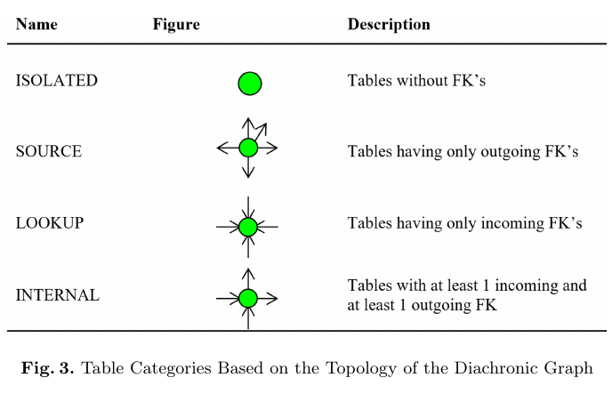
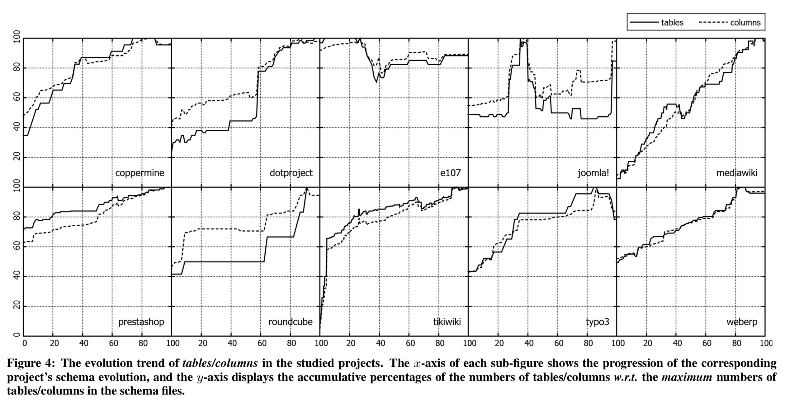
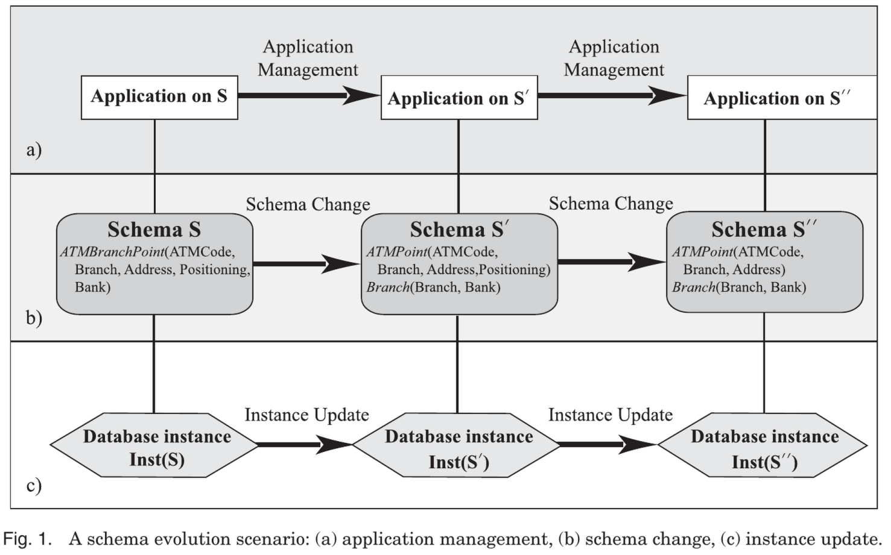
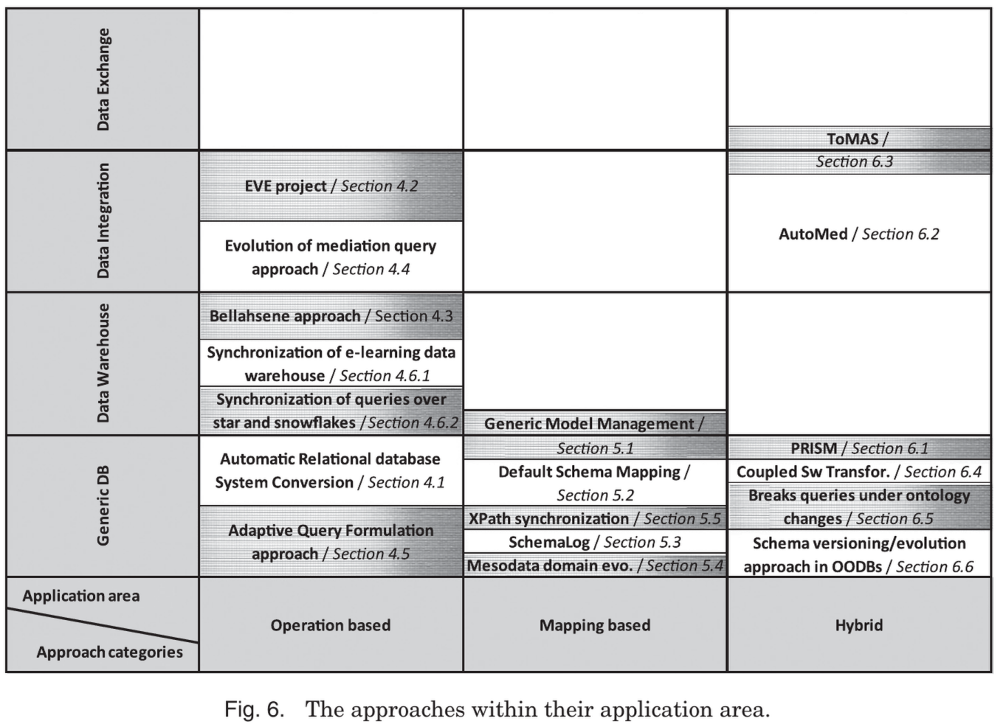
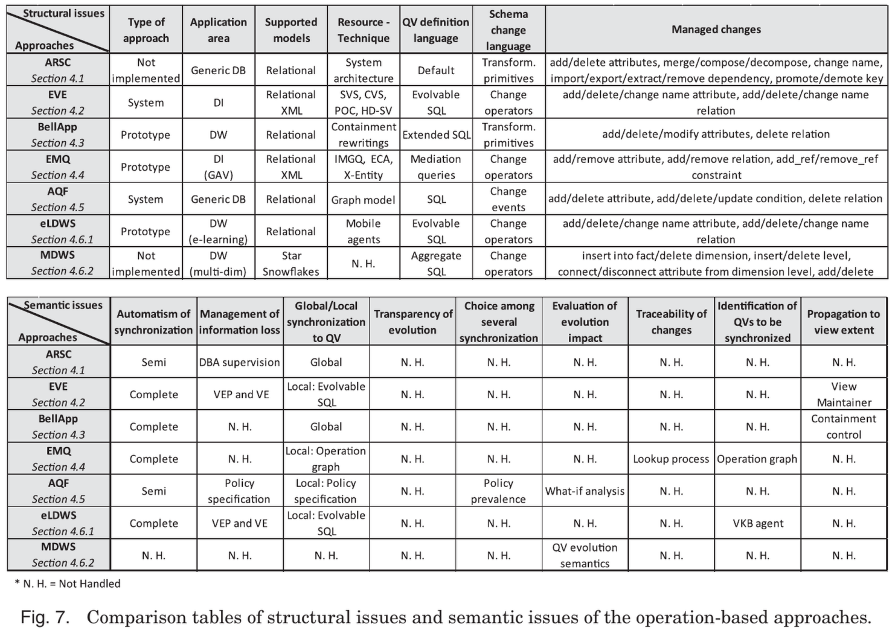
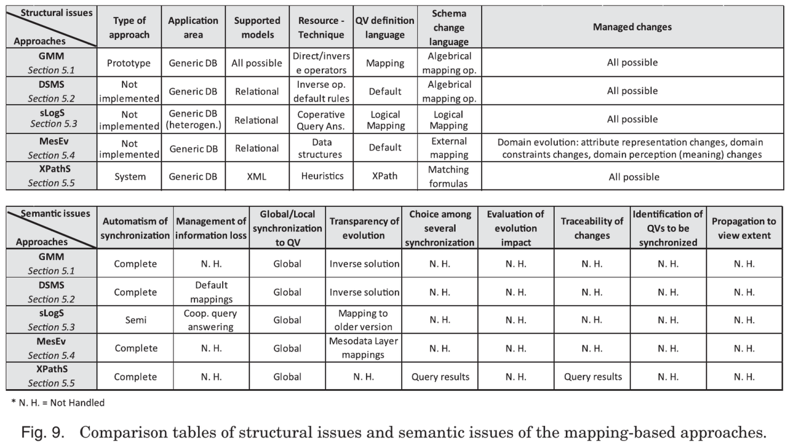
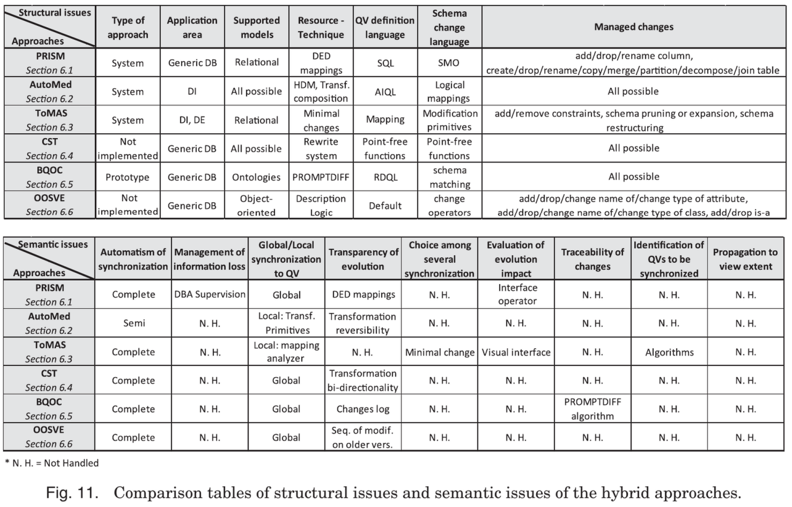

# Tutkimuskysymys

```
Mitä skeemaevoluutiossa tapahtuu? / Mitä siihen kuuluu?
Kuinka usein skeemaevoluutiota tapahtuu?
Miten skeemaevoluution vaikutuksia voi minimoida tai hallita?
```

# Runko

0. Tiivistelmä
1. Johdanto
	- Mikä on tietokanta?
	- Tietokannan suunnittelu
	- Data warehouse <> data lake, erot, NoSQL
2. Mitä on skeemaevoluutio?
	- Syyt
	- Mitä se ihan oikeasti on?
	- Pitääkö ottaa kantaa tietokantojen kehitykseen ja Big Datan nousuun?
3. Ratkaisumallit/vaihtoehdot
	- Jätetään tekemättä
4. <jotain vielä>
5. Pohdinta

# Query

SCOPUS:
```
( "schema evolution" ) OR ( "schema drift" ) AND ( LIMIT-TO ( SUBJAREA , "COMP" ) ) AND ( LIMIT-TO ( EXACTKEYWORD , "Etl" ) OR LIMIT-TO ( EXACTKEYWORD , "Extract Transform Loads" ) )
-> 16 results
```


# Lähteet ja lainaukset

-----

## Repairing ETL Processes using Extended Relational Algebra
Awiti, J., Wrembel, R. & Zimányi, E. (2025). Repairing ETL Processes using Extended Relational Algebra. Foundations of Computing and Decision Sciences, 50(2), 2025. 157-190. https://doi.org/10.2478/fcds-2025-0006

### !!! p157-158 - ETL prosessin kuvaus
```
A data warehouse (DW) system architecture typically consists of: (1) a data source
(DS) layer, (2) an extract-transform-load (ETL) layer, (3) a repository layer, that is,
a DW or data lake (DL) [50], and (4) an analytical layer. The ETL layer runs the
so-called extract-transform-load (ETL) processes that perform manipulations on data
[1]. ETL processes typically perform the following tasks: (1) extract data from DSs,
which often use different models, (2) transform data into a common model, (3) clean
data by removing missing, inconsistent, and redundant records, and (4) integrate and
load data into a final storage, which is a DW. Notice that similar components are
used for building a data lake architecture [26].
```

### !!! p158 - Mitä skeemaevoluutiossa muuttuu yleensä?
```
Most of the existing ETL tools, both commercial and open source, tacitly assume
that the structure of every DS is static. Such an assumption is often incorrect, as
in reality DSs change their structures (schemas) in time, and these changes may be
frequent. A study of the schema evolution of 195 free open source software projects
[51, 52, 54] with similar schema evolution profiles revealed that only 17% of these
projects had not experienced database schema changes. The rest of the projects had
experienced changes ranging from a few intra-table attribute modifications (33%)
to significant schema changes (11%). Other studies [55, 56] showed that the most
frequent changes in DS schemas include: (1) creating or dropping a table, (2) creating
or dropping an attribute of a table, and (3) changing the definition of an attribute.
Finally, MediaWiki, originally developed to run Wikipedia, had 171 different database
schema versions in 4 years and 7 months of its life [16].
...
In the analysis of schema changes presented in [18], tables were classified in in-
creasing order of complexity as: isolated (not involved in foreign keys), source (with
outgoing foreign keys only), lookup (with incoming foreign keys only), and internal
(with both kinds). The study revealed that less complex tables are more likely to
have a life with few or zero schema updates, whereas more complex tables are more
likely to undergo high numbers of updates. Early versions of the analyzed database
includes the births of complex tables, as opposed to the simple ones, demonstrating
a pattern of reducing the creation of complex, heavily updated tables in the schema
as time progresses.
```

### p158-159 - Miten seurataan datan historiaa ja skeemamuutoksia?
```
A data lineage [2] tool allows a user to monitor where data is coming from, where
data is being transported to, and what transformations are applied to data as it flows
through an ETL process. Some organisations rely on data lineage tools to trace error
in their data pipeline as a result of DS schema changes. A structure lineage provides
means to track dependencies between data objects in a DW/DL system, i.e., between a
DS schema, ETL objects, and a DW schema. Even though data lineage and structure
lineage tools show which part of an ETL process was impacted by a DS change, they
do not provide means for automatic or at least semi-automatic reparation of affected
ETL processes. As a consequence, such repairs have to be done manually.
``` 

#### !!! jatkuu - ratkaisuja muuttuviin ETL prosesseihin ei ole vielä kunnolla tarjolla

```
In practice, large companies deploy dozens or even hundreds of thousands of ETL
processes (e.g., in banking or pharma). Thus, a manual reparation of ETL processes
is complex and costly w.r.t. time and money. Since structural changes in DSs are
frequent, being able to use a solution for an automatic or semi-automatic reparation of
an ETL process after DS schema changes would decrease ETL maintenance time and
cost. Handling and incorporating structural changes to the ETL layer received so far
little attention from the research community [3, 35, 36, 40, 46, 58]. As a consequence,
none of the commercial or open-source ETL tools existing on the market supports
this functionality.
```


-----
## Inconsistency-Tolerant Integrity Checking
H. Decker and D. Martinenghi, "Inconsistency-Tolerant Integrity Checking," in IEEE Transactions on Knowledge and Data Engineering, vol. 23, no. 2, pp. 218-234, Feb. 2011, doi: 10.1109/TKDE.2010.87.
keywords: {Database systems;Data mining;Warehousing;Data quality;Transaction databases;Knowledge engineering;Integrity checking;inconsistency tolerance.},

### p218 - Integrity violation syitä - DBMS tuote vaihtuu, joten vaatimukset vaihtuu
```
Integrity violation may sneak into a database in many
ways. For instance, new constraints may be added without
being checked for violations by legacy data. Or, integrity
control may be turned off temporarily, e.g., when uploading
a backup for which a total check would last too long. Or,
integrity may deteriorate by migrating to the DBMS of a
different vendor, since the semantics of integrity constructs
tends to be proprietary. Or, integrity may be compromised
by the integration of databases, when constraints that had
held locally fail to hold after databases have been merged.
```

### p219 - Tutkimuksen tavoitteena on selvittää epäjohdonmukaisuuksia sietävän systeemin ja skeemaevoluution yhdistämistä
```
3. To evaluate the effects of ITIC on database evolution and
query answering. Ultimately, integrity checking is
about preserving the semantics of data through
updates and, consequently, obtaining query answers
that can be trusted. Without total integrity, full
trustability is lost. Yet, some databases may be less
inconsistent than others, and thus better behaved
wrt. query answering. In this paper, we propose a
comprehensive set of experiments for observing the
impact of ITIC on databases subject to evolution
through updates. We report both on the number of
constraint violations and on the number of incorrect
answers to complex benchmark queries. We also
compare our approach to consistent query answer-
ing [1], which is an orthogonal technique for dealing
with inconsistent data.
```

### p228 - ITIC selviää skeemaevoluution tuomista uusista rajoitteista
```
Whenever a new constraint I is added to the integrity
theory, it may be too costly to evaluate it on the spot, let
alone to immediately repair all violated cases of I. As long
as such repairs are delayed, traditional integrity checking is
not applicable, since the total integrity premise does not
hold. However, inconsistency-tolerant integrity checking
can be used, no matter for how long the repair of violated
cases is delayed.
```


-----
## A Generic Schema Evolution Approach for NoSQL and Relational Databases
A. H. Chillón, M. Klettke, D. S. Ruiz and J. G. Molina, "A Generic Schema Evolution Approach for NoSQL and Relational Databases," in IEEE Transactions on Knowledge and Data Engineering, vol. 36, no. 7, pp. 2774-2789, July 2024, doi: 10.1109/TKDE.2024.3362273.
keywords: {Data models;Taxonomy;Codes;Databases;Engines;Aggregates;Relational databases;NoSQL databases;schema evolution;Evolution management;taxonomy of changes;schema change operations},


### p2774 Skeemaevoluution yleinen kuvaus ja kommentteja sen ratkaisuista
```
Schema evolution is a classical problem in database research.
Database schemas have to be modified during the
lifetime of databases due to situations such as the appearance
of new functional or non-functional requirements, or database
refactoring. When this happens, stored data and code of database
applications must be updated to conform to the new schema,
as illustrated in Fig. 1. The desirable goal is to automate the
co-evolution of data and code for schema changes in order to
save effort and to avoid data and application errors.
For relational databases, such automation has formally been
addressed in several works that contributed with languages
and tools, among which PRISM++ [1] and DB-Main [2] are
remarkable. More recently, sophisticated commercial tools are
available to support relational schema evolution when agile
development is applied by using continuous integration and
deployment (CI/DC) [3], for example, Liquibase1 and Flyway.
```

### p2774 - NoSQL/data lake skeemaevoluution alaisena myös
```
With the advent of NoSQL stores, automating the schema
evolution of such stores is also attracting great interest [4], [5],
[6], [7]. To provide flexibility, most NoSQL systems do not
require developers to specify a schema declaration, but they are
schema-on-read: no checking against a schema is performed
when data is stored. The “schemaless” term is commonly used
to refer to this characteristic of NoSQL stores. However, not
having to declare a schema does not imply the absence of one.
Instead, it is implicit in data and code, but not specified explicitly.
Data is always stored according to the structure of a schema that
can be formally declared, or live implicit in code and data, with
developers having to write code that manipulates data by having
in mind that schema. Therefore, schema changes also occur for
NoSQL stores, and data and code co-evolution is required.
```

### p2787 - Yksi ratkaisumalli NoSQL skeemaevoluutioon
```
In this paper, we have explored the NoSQL schema evolution
by offering a generic solution: a unified data model with which
we defined a taxonomy of schema changes. We presented the
Orion schema operation language implementing this taxonomy.
Thanks to the richness of the unified metamodel abstractions, we
were able to define changes that affect aggregates, references,
and variations. The operations have been implemented for three
widely used NoSQL stores, one based in documents and schema-
less, other column-based that requires schema declarations, and
a third one based in graphs. The usefulness of our proposal
has been validated through a refactoring of the StackOverflow
dataset and an outlier migration on the Reddit dataset. This work
also presents an application of the unified metamodel presented
by Fernández Candel et al. [9]. An implementation of Athena
and Orion are publicly available on a GitHub repository.9
```


-----
## A requirement-driven approach to the design and evolution of data warehouses,
Petar Jovanovic, Oscar Romero, Alkis Simitsis, Alberto Abelló, Daria Mayorova,
A requirement-driven approach to the design and evolution of data warehouses,
Information Systems,
Volume 44,
2014,
Pages 94-119,
ISSN 0306-4379,
https://doi.org/10.1016/j.is.2014.01.004.
(https://www.sciencedirect.com/science/article/pii/S0306437914000222)

```
Abstract: Designing data warehouse (DW) systems in highly dynamic enterprise environments is not an easy task. At each moment, the multidimensional (MD) schema needs to satisfy the set of information requirements posed by the business users. At the same time, the diversity and heterogeneity of the data sources need to be considered in order to properly retrieve needed data. Frequent arrival of new business needs requires that the system is adaptable to changes. To cope with such an inevitable complexity (both at the beginning of the design process and when potential evolution events occur), in this paper we present a semi-automatic method called ORE, for creating DW designs in an iterative fashion based on a given set of information requirements. Requirements are first considered separately. For each requirement, ORE expects the set of possible MD interpretations of the source data needed for that requirement (in a form similar to an MD schema). Incrementally, ORE builds the unified MD schema that satisfies the entire set of requirements and meet some predefined quality objectives. We have implemented ORE and performed a number of experiments to study our approach. We have also conducted a limited-scale case study to investigate its usefulness to designers.
Keywords: DW; ETL; Multidimensional design; Conceptual design
```


### p94 - Miksi muutoksia tapahtuu?
```
Complex business plans and dynamic, evolving enter-
prise environments often result in a continuous flow of new
information requirements that may further require new
analytical perspectives or new data to be analyzed. Due to
the dynamic nature of the DW ecosystem, building the
complete DW design at once is not practical. Also, assuming
that all information and business requirements are available
from the beginning and remain intact is not realistic either.
At the same time, for constructing a DW design (i.e., its MD
schema) the heterogeneity and relations among existing
data sources need to be considered as well.
```

### p94-95 - Kertaluontoisen suunnittelun vaikeus ja ratkaisu siihen, jonkun toisen lähteen mukaan
```
The complexity of the monolithic approach for building a
DW satisfying all information requirements has also been
largely characterized in the literature as a stumbling stone in
DW projects (e.g., see [1]). As a solution to this problem, a step-
by-step approach for building a DW has been proposed in [1]
(a.k.a. Data Warehouse Bus Architecture). This approach starts
from data marts (DM) defined for individual business processes
and continues exploring the common dimensional structures,
which these DMs may possibly share. To facilitate this process,
a matrix as the one shown in Table 1 is used, which relates DMs
(i.e., their subsumed business requirements) to facts and
dimensions implied by each DM. 
```

### Multidimensionaalisen taulukon ja vaatimusten läpikäynti manuaalisesti on iso urakka
```
For example, it has been shown that
even for smaller data source sizes the number of potential
stars produced by means of a blind search of MD patterns
over the sources is huge [7]. Consequently, it is not feasible
to assume that the DW architect will be able to prune and
filter such results manually.
```

### Semiautomaattinne metodi data warehouse vaatimusten mukaisen mallin luomiseen
```
In this work, we present a semi-automatic method for
Ontology-based data warehouse REquirement-driven evo-
lution and integration (ORE). ORE complements the existing
methods (e.g., [5–7]) and assists on semi-automatically
integrating partial MD schemas (each representing a
requirement or a set of requirements) into a unified MD
schema design. Moreover, ORE could also be used to
integrate existing MD schemas of any kind (e.g., as in
[11]). ORE starts from a set of MD interpretations (MDIs)
of individual requirements (which resemble the rows of
Table 1). Intuitively, an MDI is an MD characterization of the
sources that satisfies the requirement at hand (see Section
2.2 for further details). Iteratively, ORE integrates MDIs into
a single MD schema which satisfies all requirements so far.
Importantly, ORE generates MD-compliant results (i.e., ful-
filling the MD integrity constraints) and determines the best
integration options according to a set of quality objectives,
to be defined by the DW designer. To guarantee so, ORE
systematically traces valuable metadata from each integra-
tion iteration. During this entire process, the role of the data
sources is crucial and ORE requires a characterization of the
data sources in terms of a domain ontology, from where to
automatically explore relationships between concepts (e.g.,
synonyms, functional dependencies, taxonomies, etc.) by
means of reasoning.
Our method, ORE, is useful for the early stages of a DW
project, where we need to create an MD schema design
from scratch, but it can also serve during the entire DW
lifecycle to accommodate potential evolution events. As we
discuss later on, in the presence of a new requirement, our
method does not create an MD design from scratch, rather it
can automatically absorb the new requirement and inte-
grate it with the existing MD schema.
```


-----
## Still Open Problems in Data Warehouse and Data Lake Research
Robert Wrembel
Poznan University of Technology
Faculty of Computing and Telecommunications
Poznan, Poland
robert.wrembel@put.poznan.pl

### Yhä väitetään ettei ole tutkittu, ainakaan ei ole työkaluja
```
An almost unexplored area for both DW and DL archi-
tectures is the management of structural changes in data
sources at the integration layer (i.e., the ETL/DPW/DPP). In
practice, data sources change their structures (i.e., schemas)
frequently [12], [13]. Typically, after such changes, a pre-
designed and already deployed integration processes cannot
be executed and must be repaired. So far, such a repair is
done manually by an ETL designer, as neither commercial
nor open source integration tools support (semi-)automatic
repairs of such processes. Few solutions to this problem have
been proposed so far, e.g., [14]–[17], but they still require
substantial work from an ETL designer and they are applicable
to simple DS changes and simple data processing workflows
only.
(Semi-)automatic repair of integration processes turned out
to be extremely difficult for traditional (mainly relational) DSs
and it becomes even more difficult in a big data eco-system;
firstly - because big data evolve much more frequently than
traditional data sources, and secondly - because there are many
more data models and formats to be handled while integrating
data.
```

-----
## Graceful database schema evolution: the PRISM workbench
Carlo A. Curino, Hyun J. Moon, and Carlo Zaniolo. 2008. Graceful database schema evolution: the PRISM workbench. Proc. VLDB Endow. 1, 1 (August 2008), 761–772. https://doi-org.ezproxy.uef.fi:2443/10.14778/1453856.1453939


### p761 Skeema-muutoksen vaikutuksia
```
Both practitioners and researchers are well aware that schema
modifications can: (i) dramatically impact both data and
queries [8], endangering the data integrity, (ii) require ex-
pensive application maintenance for queries, and (iii) cause
unacceptable system downtimes. 
```

### p761 Avoimen lähdekoodin web-asiat ovat erityisen alttiita muutoksille
```
The problem is particu-
larly serious in Web Information Systems, such as Wikipedia
[33], where significant downtimes are not acceptable while a
mounting pressure for schema evolution follows from the di-
verse and complex requirements of its open-source, collabo-
rative software-development environment [8].
```


### p762 SMO ja miten PRISM toimii lyhyesti
```
PRISM exploits the concept of Schema Modification
Operators (SMO) [4], representing atomic schema changes,
which we then modify and enhance by (i) introducing the
use of functions for data type and semantic conversions, (ii)
providing a mapping to Disjunctive Embedded Dependen-
cies (DEDs), (iii) obtain invertibility results compatible to
[13], and (iv) define the translation into efficient SQL prim-
itives to perform the data migration.
```


### p771-772 PRISM tarkempi kuvaus, ratkaisu skeemaevoluution hallintaan
```
We presented PRISM, a tool that supports the time-
consuming and error-prone activity of Schema Evolution.
The system provides the DBA with a concise operational
language to represent schema change and increases predictabil-
ity of the evolution being designed by automatically verify-
ing information preservation, redundancy and query sup-
port. The SMO-based representation of the schema evo-
lution is used to derive logical mappings between schema
versions. Legacy queries are thus supported by means of
query rewriting or automatically generated SQL views.
The system provides interfaces with commercial relational
DBMSs to implement the actual data migration and to de-
ploy views and rewritten queries. As a by-product, the
schema evolution history is recorded. This represents an in-
valuable piece of information for the purposes of documenta-
tion, database flash back, and DBA education. Continuous
validation against challenging real-life evolution histories,
such as the one of Wikipedia, proved invaluable in mold-
ing PRISM into a system that builds on the theoretical
foundations laid by recent research and provides a practical
solution to the difficult problems of schema evolution.
```


-----
## !!!!!!!!! The data warehouse lifecycle toolkit (2nd ed.)
Kimball, R., & ProQuest. (2008). The data warehouse lifecycle toolkit (2nd ed.). Wiley Pub.,. http://ezproxy.uef.fi:2048/login?url=http://ebookcentral.proquest.com/lib/uef-ebooks/detail.action?docID=675005


Kimball, Ralph, et al. The Data Warehouse Lifecycle Toolkit, John Wiley & Sons, Incorporated, 2008. ProQuest Ebook Central, http://ebookcentral.proquest.com/lib/uef-ebooks/detail.action?docID=675005.
Created from uef-ebooks on 2026-02-13 09:55:30.


### Miksi muutoksia tapahtuu ja miksi se on hyvä merkki?
```
Prepare for Growth and Evolution 
A successful DW/BI system will evolve and grow. If anything, you should constantly be forced to throttle back the requests for new data sources, faster delivery of data, new data mining scores and labels, and new key performance indicators. A changing system is a sign of success, not failure. It indicates your existing business users are asking for more data and BI applications. At the same time, they're spreading the news about the DW/BI system at the grass roots level, so new users will be clamoring for data, tools, and applications. Everyone involved with the DW/BI system from both the business and IT communities should anticipate and appreciate the evolution of the system as it matures. The factors that influenced the early design of your data warehouse—including business sponsorship, users and their requirements, technical architecture, and available source data—are evolving rapidly. 
```

### Kimball Lifecycle on yksi tapa hoitaa muutosta?
```
The Kimball Lifecycle approach is designed to help the data warehouse respond gracefully to change. Before you think about growth opportunities, you should assess your current environment.
```

### ETL prosessin tuntemus apuna kehityksessä, MYÖS DATA QUALITY MANAGEMENT ja error event schema
```
The ETL system described in Chapters 9 and 10 and constructed for your first deliverable should be a strong foundation for future development. It's common for second phase projects to have more complex ETL than the initial project. But as an offset, now your ETL developers have tool expertise, and have built the techniques and infrastructure for running the ETL system in your environment. The design we described for data quality tracking is intended to be expanded incrementally. Once the error event schema is in place, then data quality screens can be added one at a time indefinitely. A data quality team should constantly be improving quality by proposing and implementing new and better screens.
```


-----
## Significance and challenges of big data research
X. Jin, B.W. Wah, X. Cheng, Y. Wang, “Significance and challenges of
big data research”, Big Data Research, 2:(2), 2015, pp. 59–64

## p59-60 - Mitä on big data ja mikä erottaa sen perinteisestä datasta - 5V:tä
```
What is big data? So far, there is no universally accepted def-
inition. In Wikipedia, big data is defined as “an all-encompassing
term for any collection of data sets so large and complex that it
becomes difficult to process using traditional data processing ap-
plications” [8]. From a macro perspective, big data can be regarded
as a bond that subtly connects and integrates the physical world,
the human society, and cyberspace. Here the physical world has a
reflection in cyberspace, embodied as big data, through Internet,
the Internet of Things, and other information technologies, while
human society generates its big data-based mapping in cyberspace
by means of mechanisms like human–computer interfaces, brain–
machine interfaces, and mobile Internet [9–11]. In this sense, big
data can basically be classified into two categories, namely, data
from the physical world, which is usually obtained through sen-
sors, scientific experiments and observations (such as biological
data, neural data, astronomical data, and remote sensing data), and
data from the human society, which is often acquired from such
sources or domains as social networks, Internet, health, finance,
economics, and transportation.
Compared to traditional data, the features of big data can be
characterized by 5V, namely, huge Volume, high Velocity, high
Variety, low Veracity, and high Value. The main difficulty in cop-
ing with big data does not only lie in its huge volume, as we
may alleviate to some extent this issue by reasonably expanding
or extending our computing systems. Actually, the real challenges
center around the diversified data types (Variety), timely response
requirements (Velocity), and uncertainties in the data (Veracity).
Because of the diversified data types, an application often needs
to deal with not only traditional structured data, but also semi-
structured or unstructured data (including text, images, video, and
voice). Timely responses are also challenging because there may
not be enough resources to collect, store, and process the big data
within a reasonable amount of time. Finally, distinguishing be-
tween true and false or reliable and unreliable data is especially
challenging, even for the best data cleaning methods to eliminate
some inherent unpredictability of data.
```


-----

## !!!!! A study on the effect of a table’s involvement in foreign keys to its schema evolution
Dimolikas K., Zarras A. V., and Vassiliadis P. A study on the effect of a table’s
involvement in foreign keys to its schema evolution. In International Conference
on Conceptual Modeling ER, volume 12400 of LNCS, pages 456–470. Springer,
2020.

## !!! Minkälaiset taulut muuttuvat useimmiten?



```
A Topological Hierarchy and Its Evolutionary Behavior. After observing
that different topological categories differ in their evolution, we came at an
unexpected finding: there is a hierarchy of topologically increasing complexity
reflected on how tables are evolved by developers of FOSS projects.

Complexity Hierarchy : Isolated → Source −→ Lookup → Internal

We have discovered that the complexity spectrum that results from this hier-
archy relates to the behavior of tables. On the high end of the complexity spec-
trum, the internal tables demonstrate quite a different life than the isolated
tables at the other end of it. Complex internal tables demonstrate high activ-
ity –which means the undergo attribute additions, deletions and type updates–
whereas isolated tables undergo very little if zero change. Remember that we
are studying data sets with hundreds of commits spanning into several years of
monitoring. At the very same time, internal tables are almost totally born at
the earliest version of the database history: in other words, there are no inter-
nal, topologically complex, and, probably active, tables born after the initiation
of the database. The phenomenon is quite opposite for isolated tables: despite
the fact that a fair percentage of them is present in the original version of the
database, isolated tables are the most likely to be added in subsequent versions
```

## !!! Miksi em. löydös toteutuu?
```
Why is this Happening? As also noted in the past [8,12], the main force that
seems to govern schema evolution, at least in the Free Open Source Software
(FOSS) setting that we study, is gravitation to rigidity, due to the difficulty
of altering the schema of a database when surrounding code is built upon it.
The same seems to be observed here too: (a) inactive, topologically simple tables
are much more populous and easy to create than complex and active ones; (b)
very few tables change topological category (Fig. 4), with most changes in the
ephemeral or short-lasting categories of label-changes; (c) different topological
categories seem to have different evolutionary behaviors – specifically, most of
the activity of the high-end of the complexity spectrum is due to the addition of
attributes to the existing structures, quite differently from the lower end of the
spectrum, where administrators are more inclined towards building new tables.
We conjecture that an explanation for this difference in behavior is the avoid-
to-break-the-code principle: adding new information via new tables, which can
later be removed if not useful, does not result in the necessity to update the
surrounding code that queries and updates the existing tables. This leads to
maintenance-by-addition and simplifies the life of developers, at the expense,
of course, of increasing the size of the schema and fragmenting the information
into many tables. So, developers augment the database with simple topologies,
and if complex topologies need expansion, this is done via attribute injection.
A second reason that we conjecture affects the evolutionary profile of tables, is
the deployment of projects. Remember we are studying FOSS projects, built to
be selected by other organizations. Once a FOSS project has been adopted and
deployed by an organization, future upgrades might result in the change of the
schema too. Upgrading the schema in the presence of existing data is a painful
experience, and simple structures and maintenance-by-addition reduce this pain.
```

## Omaa pohdintaa:
```
Näyttäisi siltä, että kehittäjät ovat itsenäisesti "löytäneet" yhden tehokkaan
tavan hallita skeemaevoluution haittavaikutuksia: Mieluiten luodaan uusia pieniä
tauluja tai muutetaan vanhojen taulujen attribuutteja.
```


-----
## Evolution management in multi-model databases
I. Holubová, M. Vavrek, and S. Scherzinger, “Evolution manage-
ment in multi-model databases,” Data Knowl. Eng., vol. 136, 2021,
Art. no. 101932.

### Monimuotoisen tietokannan kuvaus

```
While the core multi-model challenges have already been solved (at least to some extent) in order to enable the basic necessary functionality, there still remain advanced and complex tasks to be analyzed and fulfilled [4]. One of them, being our aim in this paper, is evolution management. 

As user requirements change, the data structures evolve, and, consequently, also the respective storage strategy, queries, etc. This problem is challenging even in the world of single-model databases. In simpler applications, we can rely on a skilled database administrator, but in more complex situations it is a difficult and error-prone task requiring correct and complete propagation of a change to all affected parts of the system. In addition, we can observe contradictory approaches to this problem in different types of DBMSs. 

In the world of traditional relational or XML databases, schema evolution requires immediate changes to both the schema and the data instance (eager propagation). With NoSQL systems, we can (to some extent) exploit the support for redundancy and schemalessness, i.e., the ability to store data with similar, but not necessarily the same structure, and propagate the changes when needed (lazy propagation).
```


### Toimiva malli monimuotoisen tietokannan evoluution hoitamiseen

```
5. Conclusion
Multi-model data instances have become a new phenomenon that fundamentally challenges traditional approaches to data management. Databases traditionally designed for highly specific tasks now need to be able to manage data whose particular sub-parts have different, even contradictory features and requirements for efficient processing. In addition, the changes in user requirements, that need to be reflected not only in the user-specified part, but also globally in all other affected parts, further complicate this issue. In this paper we showed the first step towards a robust solution of evolution management of multi-model data. We introduce a tool which enables users to specify required changes over a multi-model schema and propagates them across all sub-models. The main advantages of the proposal are as follows:

• We cover all the currently popular data models.
• We deal with both intra-model and inter-model changes.
• We support also mutual references between the models.
```


-----
## CODS: evolving data efficiently and scalably in column oriented databases. 
Ziyang Liu, Sivaramakrishnan Natarajan, Bin He, Hui-I Hsiao, and Yi Chen. 2010. CODS: evolving data efficiently and scalably in column oriented databases. Proc. VLDB Endow. 3, 1–2 (September 2010), 1521–1524. https://doi-org.ezproxy.uef.fi:2443/10.14778/1920841.1921028

### Tietokantaevoluutio sisältää kaksi osaa: Skeemaevoluutio, joka aiheuttaa dataevoluution

```
Database evolution consists of two steps: schema update and
data evolution. Existing work on database evolution mainly studies
the first step, specifically, the interfaces and operators needed for
schema update and the maintenance of associated views/applications.
A system for supporting automatic schema evolution, the PRISM
workbench [5], provides support for predicting the effect of schema
update, implementing logical independence, improving audibility,
rewriting queries, etc. However, efficient algorithms for evolving
the data from the original schema to the new schema is yet to be
investigated. Currently, data evolution is expressed and executed
at query level, i.e., via SQL queries. 
```

-----
## An Empirical Study on the Design and Evolution of NoSQL Database Schemas

Scherzinger S., Sidortschuck S.
AUTHOR FULL NAMES: Scherzinger, Stefanie (16317498000); Sidortschuck, Sebastian (57219496414)
16317498000; 57219496414
An Empirical Study on the Design and Evolution of NoSQL Database Schemas
(2020) Lecture Notes in Computer Science (including subseries Lecture Notes in Artificial Intelligence and Lecture Notes in Bioinformatics), 12400 LNCS, pp. 441 - 455, Cited 24 times.
DOI: 10.1007/978-3-030-62522-1_33
https://www.scopus.com/inward/record.uri?eid=2-s2.0-85097385437&doi=10.1007%2f978-3-030-62522-1_33&partnerID=40&md5=fe3ab45031fe101795700c8dad786e5c

DOCUMENT TYPE: Conference paper
PUBLICATION STAGE: Final
OPEN ACCESS: All Open Access; Green Open Access
SOURCE: Scopus


### Miten skeeman muutoksia ja kasvua mitataan tutkimuksissa? (Taulujen lukumäärällä ja skeema-LoC proxy mittarilla)
```
In empirical studies on relational schema evolution, the number of tables is
considered a simple approximation for schema complexity [9]. Accordingly, we
track the number of entity-classes over time in Fig. 3 (based on a visualization
idea from [14]). For each project, one chart is shown. On the horizontal axis, we
track the progress of the project, measured as the percentage of git commits
analyzed. For the madcap project, this is based on 853 commits (c.f. Table 1).
On the vertical axis, we track the size of the NoSQL database schema using two
metrics. One is the number of entity-classes (blue solid line). This metric is also
normalized w.r.t. its maximum throughout the project history. So for madcap,
the 100% peak corresponds to 82 entity-classes, some of which were removed
in the later phase of the project. We refer to Table 1 for the exact number of
entity-classes added and removed.
The second line denotes a “proxy metric” [9] for the size of the NoSQL
schema, where we count the lines of code of entity-classes (including superclasses,
excluding comments and empty lines), and thereby compute the Schema-LoC .10
There is shrinkage, yet overall, schema complexity increases.
```

### Lähes aina skeema kasvaa, mutta refactoring aiheuttaa pieniä kuoppia kasvussa. 
```
Results. 1) As in the study by Qiu et al. on relational software evolution [14], we
can confirm that while the projects differ in their life-spans and commit activity, 
in nearly all projects, the NoSQL schema grows over time. However, there
are phases of refactoring, causing dips. 2) Apparently, Schema-LoC lends itself
nicely as a proxy-metric, and we obtain high correlation coefficients when com-
paring to the number of entity-classes. As Schema-LoC depends on the number
of attributes in an entity-class, we can retrace an effect reported in [14], namely
that entity-classes and their attributes (corresponding to tables and columns)
have largely analogous dynamics. 3) In general, the schema grows more than
it shrinks. This is in line with studies on relational schema evolution. 
```

### Tämä tutkimus keskittyy NoSQL ja tutkimuksen tuloksena todetaan, että NoSQL skeemaevoluutio jatkuu tasaisempana ja pidempään kuin perinteiset tietokannat, joiden muutokset painottuvat projektin alkuvaiheeseen.
```
One observation in [14] was that the schema stabilizes early: There, for 7 out of 10
projects, 60% of the maximum number of tables is reached in the first 20% of
the commits. Interestingly, in our study, the number of entity-classes reaches
the 60% in only 4 projects. 5) In [14], less than 2% of all commits contain valid
schema changes (across all ten projects analyzed there). In our study, the share
of commits with schema-relevant changes is between 2.8% and over 30%, with 4
projects reaching over 20%. Clearly, we observe higher schema churn rates.
```

### p451 - Myös NoSQL skeemat muuttuvat ja suunta on pääosin kasvava
```
5 Discussion

We can reproduce the main results from related work on relational schema evo-
lution: There is strong evidence of NoSQL schema evolution, and additions are
dominant schema changes. However, we do not see the schema stabilizing in
the early phases of all projects, which may partly be due to shorter project life
spans: The ten projects studied in [14] are PHP applications backed by relational
databases, and have longer life cycles (two with ten years), more commits (start-
ing at nearly 5K), and more lines of code. This is to be expected with a more
mature software stack. Still, we do suspect that NoSQL developers evolve their
schema more continuously. One indicator supporting this hypothesis is that a
larger share of the commits contains code changes that affect the schema.
What stands out is that in relational schema evolution, type changes have
been found to be among the most frequent schema changes [14,25], and we do
not see this effect in NoSQL schema evolution. One conjecture is that in the SQL
data definition language (and its many dialects), there is a richer set of types. For
instance, character data may be stored as char(n) varchar(n), nvarchar(n),
or clob (a listing which is not necessarily exhaustive). In contrast, in Google
Cloud Datastore, there are merely the Java types String and Text. Thus, it is
plausible that we observe fewer type changes in NoSQL schemas.
The fact that denormalization is common shows that solutions for managing
relational schema evolution, involving flat tuples, will not transfer immediately.
Rather, when devising frameworks, we may want to turn to related work on
frameworks for handling schema evolution in XML (e.g. [8,11]) or object-oriented
databases (e.g. [26]) for inspiration on what has shown to be feasible.
```


-----
## An empirical analysis of the co-evolution of schema and code in database applications

Qiu D., Li B., Su Z.
AUTHOR FULL NAMES: Qiu, Dong (36618249400); Li, Bixin (9334814500); Su, Zhendong (7402248744)
36618249400; 9334814500; 7402248744
An empirical analysis of the co-evolution of schema and code in database applications
(2013) 2013 9th Joint Meeting of the European Software Engineering Conference and the ACM SIGSOFT Symposium on the Foundations of Software Engineering, ESEC/FSE 2013 - Proceedings, pp. 125 - 135, Cited 83 times.
DOI: 10.1145/2491411.2491431
https://www.scopus.com/inward/record.uri?eid=2-s2.0-84883716265&doi=10.1145%2f2491411.2491431&partnerID=40&md5=b97de8a9da048d0646ad4834c43a4cba

DOCUMENT TYPE: Conference paper
PUBLICATION STAGE: Final
SOURCE: Scopus

### Tutkimuskysymykset ja rajaus

Tässä tutkimuksessa keskityttiin erityisesti ohjelmistokehitykseen.

```
RQ1: How frequently and extensively do database schemas evolve?
This RQ helps answer how often and how much schemas
change across different versions to understand whether they
intensively evolve during an application’s development and
maintenance process.
RQ2: How do database schema evolve? This RQ helps analyze
all possible schema changes in database applications to un-
derstand what schema change types usually occur in prac-
tice. Furthermore, we are interested in the distribution of
schema changes w.r.t. schema change type to see whether
some change types appear more frequently than others.
```

### Trendikaavio taulujen/kolumnien määrän kasvusta
Tässä näkyy hyvin, kuinka paljon ja missä vaiheessa projektia skeemaevoluutiota tapahtuu.



### !!!!! Kuinka tiheästi muutoksia tapahtuu?

Taulukossa 4 näkyy keskiarvona: Tutkimukseen mukaan otettuja muutoksia on näissä 10 projektissa 20.5 kertaa vuodessa. Vastaavasti atomisia muutoksia on 90.0 kappaletta vuodessa.

Alla GR = growth rate
```
RQ1: How frequently and extensively do
schemas evolve?
First, we measure how frequently schemas evolve by examining
the occurrences of schema changes w.r.t. each project’s lifecycle.
In particular, for each stable release/year, we calculate the average
number of valid DB revisions/atomic schema changes. Table 4
reports this information. For each release, there are around 5∼25
valid DB revisions and 15∼180 atomic schema changes. For each
year, there are around 10∼65 valid DB revisions and 15∼300 atomic
schema changes. Although the numbers in each column differ
due to the projects’ varying levels of development activities and
different definitions of stable releases, they provide solid evidence
that schemas evolve frequently.

Results 1) Schemas evolve frequently: on average 65 atomic
schema changes occurred per release, and 90 atomic schema changes
occurred per year across the ten projects. 2) The size of schemas in
most projects grew significantly: The GR of tables in 60% of the
projects exceeded 100%; the CR of tables in 90% projects exceeded
100%. Although the number of tables in some projects increased
slowly or even decreased (such as e107), they show frequent fluc-
tuations. 3) We have observed very similar trend for columns (as
compared to tables). 4) Seven projects’ schema sizes reached 60% of
their maximum values in about 20% of the selected project lifecycle,
which indicates that more database related features were imported
in the projects’ early development phases.
```

### !!!!! Mitä muutoksia skeemaan tehtiin?

```
RQ2: How do database schemas evolve?
Results 1) Three high-level schema change categories, Trans, SR
and DQR, covered most schema changes; AR occurred relatively
infrequently in some of the projects. 2) At the low-level, add table,
add column and change column datatype were the most frequent
atomic change types. 3) The data also confirms that referential
integrity constraints (such as foreign key and trigger) and procedures
(such as stored procedure) are indeed rarely used in practice. 4)
Addition and change accounted for most of the schema evolution.
```

### Skeemamuutokset keskittyvät vain harvoihin tauluihin

Tämä löydös oli myös jossain toisessa tutkimuksessa.

```
Figure 8 shows the coverage of schema changes by tables. We see
that around 60%∼90% of the schema changes happened in 20% of
the tables — most tables (around 40%) are rarely changed during
the development lifecycle. The evolution histories of frequently
changed tables are sufficient. The most frequently modified tables
in total have covered over 80% of all the schema changes (i.e., the
total number of atomic schema changes occurred).
```


-----
## Handling evolution in big data architectures

Scopus
EXPORT DATE: 13 February 2026

Solodovnikova D., Niedrite L.
AUTHOR FULL NAMES: Solodovnikova, Darja (35241260000); Niedrite, Laila (6504069899)
35241260000; 6504069899
Handling evolution in big data architectures
(2020) Baltic Journal of Modern Computing, 8 (1), pp. 21 - 47, Cited 9 times.
DOI: 10.22364/BJMC.2020.8.1.02
https://www.scopus.com/inward/record.uri?eid=2-s2.0-85085364057&doi=10.22364%2fBJMC.2020.8.1.02&partnerID=40&md5=d998359e94394c57594f708349339f4b

DOCUMENT TYPE: Article
PUBLICATION STAGE: Final
OPEN ACCESS: All Open Access; Gold Open Access
SOURCE: Scopus

### Miksi skeemaevoluutiota tapahtuu
```
One of such problems is a data warehouse evolution that occurs due to changes
in business requirements or data sources or improvements of a data warehouse design.
```

### Erilaisia tapoja ratkaista data warehouse evoluutiota, viittauksia muihin

```
There are in general two approaches to solving evolution problems. One approach is
to adapt just the existing data warehouse schema (Bentayeb et al., 2008) or ETL pro-
cesses (Wojciechowski, 2018) without keeping the history of changes and another ap-
proach (Ahmed et al., 2014; Golfarelli et al., 2006; Malinowski and Zimnyi, 2008) is to
maintain multiple versions of schema that are valid during some period of time. Futher-
more, several studies (Thakur and Gosain, 2011; Thenmozhi and Vivekanandan, 2014;
Solodovnikova et al., 2015) propose solutions to the formalization of requirements of a
data warehouse and treatment of their evolution.
```

### Miksi Big Data on erityisen herkkä muutoksille?

```
Data maintenance must be provided by the architecture, since Big Data are
dynamic and up-to-date data from data sources are necessary for the analysis. Data
required for the analysis are often semi-structured or even unstructured, it is important
to dicover changes in such data and to handle them properly. New data sources may
become available and necessary to support new or more valuable analysis capabilities
provided by the Big Data analysis system. If Big Data available for the analysis are
structured into a schema (integrated target or global schema), evolution of such schema
(denoted as schema evolution in Table 2) may occur because of changes in information
requirements of the system, for example, when additional data may become necessary
for decision-making, or after changes in data sources.
```

### Miten Big Data evoluutio on mahdollista hoitaa eri tyyppisissä Big Data toteutuksissa?

```
Evolution is handled in different ways in the studied architectures. Data mainte-
nance is supported by ETL processes in Big Data warehousing architectures. Data lakes
(Dobson et al., 2018; Hai et al., 2016; Zhuang et al., 2016) accumulate source data in
its’ original format. 
Virtual integration architectures (ElSheikh et al., 2013; Yuan et al.,
2010) do not store copies of source data, therefore, maintenance problem is solved nat-
urally. Polystores (Wang et al., 2017), λ-architectures (Nadal et al., 2017) and other
architecture types (Alsubaiee et al., 2014) apply specific operations, such as union, in-
sert and delete or do not consider a data maintenance problem at all.
```

### Big Data ei juurikaan ota huomioon skeemaevoluutiota?!

```
Schema evolution is not considered in the majority of Big Data warehouse architec-
tures or is handled by slowly changing dimensions and versioning approaches that are
well known in the field of traditional relational data warehouses (Chen, 2010). Archi-
tectures that include data lakes (Hai et al., 2016; Zhuang et al., 2016) use metadata to
process changes in the integrated target schemata. In case of other architecture types,
schema evolution is not considered or may be implemented only manually.
```


-----
## Knowledge Graph-Enabled Cancer Data Analytics
S. M. S. Hasan, D. Rivera, X. -C. Wu, E. B. Durbin, J. B. Christian and G. Tourassi, "Knowledge Graph-Enabled Cancer Data Analytics," in IEEE Journal of Biomedical and Health Informatics, vol. 24, no. 7, pp. 1952-1967, July 2020, doi: 10.1109/JBHI.2020.2990797.
keywords: {Cancer;Resource description framework;Tumors;Data models;Libraries;Data analysis;Data visualization;Knowledge graph;cancer registry;treatment},

**Jos tämä lähde otetaan mukaan, täytyy selittää myös knowledge graph termi ja analysoida sitä! Onko sen arvoista?**


### Knowledge graph on helppo muuttaa ja skeemaevoluutio ei vaikuta läheskään niin paljon
```
However, because of the flexible
structure of knowledge graphs, it is easier to handle schema
changes and evolution. To address the data discrepancy problem,
we added new nodes and edges to the graph without substantially
changing the core software code that uses the knowledge graph
(see Fig. 7).
```


-----
## Data lake management: challenges and opportunities
Fatemeh Nargesian, Erkang Zhu, Renée J. Miller, Ken Q. Pu, and Patricia C. Arocena. 2019. Data lake management: challenges and opportunities. Proc. VLDB Endow. 12, 12 (August 2019), 1986–1989. https://doi-org.ezproxy.uef.fi:2443/10.14778/3352063.3352116

### Data lake määritelmä
```
A data lake is a massive collection of datasets that: (1)
may be hosted in different storage systems; (2) may vary
in their formats; (3) may not be accompanied by any use-
ful metadata or may use different formats to describe their
metadata; and (4) may change autonomously over time. 
```

### Tällä hetkellä Data lake on vain väliaikainen säilytyspaikka datalle, sieltä on vaikea hakea tietoa suoraan.
```
Second, data lakes are cur-
rently mostly intermediate repositories for data. Currently,
this data does not become actionable until it is cleaned and
integrated into a traditional DBMS or warehouse. A grand
challenge for data lake management systems is to support
on-demand query answering meaning data discovery, extrac-
tion, cleaning, and integration done at query time over mas-
sive collections of datasets that may have unknown struc-
ture, content, and data quality. Only then would the data
in data lakes become actionable.
```


-----
## Synchronization of Queries and Views Upon Schema Evolutions: A Survey. 
Loredana Caruccio, Giuseppe Polese, and Genoveffa Tortora. 2016. Synchronization of Queries and Views Upon Schema Evolutions: A Survey. ACM Trans. Database Syst. 41, 2, Article 9 (June 2016), 41 pages. https://doi-org.ezproxy.uef.fi:2443/10.1145/2903726


### Tutkimuksen tarkoitus ja syy
```
In order to an-
alyze and classify the existing approaches in a uniform and inclusive way, in this
article, we survey existing query/view synchronization approaches providing a frame-
work to describe, classify, and systematically compare them. In particular, the survey
aims to pursue the following goals: (1) to analyze existing query/view synchronization
approaches; (2) to provide a comprehensive and classified list of them, useful for re-
searchers, database designers, and database tool vendors; and (3) to help users select
the approaches more suitable for their purposes.
```

### Skeemaevoluution määritelmä ja tarve

```
During the life cycle of an information system, it is often necessary to modify the
schema of the underlying database. This might occur either to correct previous design
and implementation errors or to adapt the information system to changes in the real
world. This is a well-known and critical problem, named Schema Evolution, which
has drawn the attention of many researchers in the database community. In fact,
there are many artifacts depending on the old version of a database schema, which
might need to be modified in order to continue work on the new schema.
```

### Skeemaevoluutiossa erityisesti views+queries täytyy synkronisoida

```
In particular,
queries and views might no longer work properly if the schema update operations
concern constructs of the old schema on which they were defined. Thus, they need to
be synchronized to the new schema.
There are many other contexts in which it is necessary to synchronize queries and
views upon schema evolution operations, for example, in data warehouses, data inte-
gration systems, web services, and mashup development [Moro et al. 2007].
The problem of synchronizing queries and views upon a schema evolution has been
faced since 1982, and it has been considered a major bottleneck in system conversion.
```

### Erilaisia tapoja selvitä skeemaevoluutiosta

```
Thus, the research community has focused
its attention on the development of approaches capable of mitigating the inherent com-
plexity of the synchronization process, such as (1) approaches applying updates in a
lazy fashion or (2) approaches capable of tolerating the presence of queries and views
working on previous versions of a database schema. Lazy update approaches have
been proposed to cope with delayed synchronization processes [Ferrandina et al. 1994],
whereas tolerating approaches assume that only new applications are relevant, while
old ones are discarded. When old applications have to be maintained, schema version-
ing provides an alternative solution to the query/view synchronization problem [De
Castro et al. 1997; Grandi and Mandreoli 2003; Jørgensen and Böhlen 2007; Jensen
and Böhlen 2002]. The adoption of schema versioning lets old applications continue
work with the old schema, whereas new applications will work with the new schema.
```

### Kuva/taulukko, miten skeemaevoluutio vaikuttaa sekä koodiin että dataan (myös dataevoluutio!!!)

Kuvasta nähdään hyvin, miten skeemaevoluutio aiheuttaa tarpeen muuttaa myös sovelluskoodia että itse datan päivitys.



### Operaatiopohjainen skeemaevoluution määritelmä

Tämä näkökulma tarkastelee skeemaevoluutiota sen perustella, millä komennoilla skeemaa muutetaan.

```
Operation based includes approaches based on the editing process, that is, approaches
that define schema modification commands to implement each type of supported
changes. More specifically, the operation-based approaches define several modification
operations to specify the effects of single modifications on both schemas and instances
(see Banerjee et al. [1987], Zicari [1991], Roddick et al. [1993], Peters and Özsu [1997],
and Moro et al. [2007]). Such approaches enable the management of both simple and
composed schema modifications.

As an example, by using the schema modification operators defined in the SMO
language [Curino et al. 2008b], an operation-based specification of the schema evolution
S →S of Figure 1 is

DROP COLUMN positioning FROM ATMPoint. 
```

### Mapping based skeemaevoluution määritelmä

Tämä näkökuilma tarkastelee skeemaevoluutiota sen perusteella, mitä yhteisiä ominaisuuksia ja eroja alkuperäisellä ja lopullisella skeemalla on. Ominaisuudet "mäpätään".

```
Mapping based includes approaches based on the editing result, that is, approaches
that allow one to modify the schemas as necessary and then compare the two schema
versions [Lerner 2000]. Thus, they mainly focus on the detection of correspondences
between schema versions, which can be represented by means of mappings [Bertino
1992; Lakshmanan et al. 1993; Lerner 2000; Bernstein et al. 2000; Bernstein and
Rahm 2000; Melnik 2004; Bernstein 2003; Bernstein and Melnik 2007; Velegrakis et al.
2004a].
```

### Data Warehouse määritelmä

**Tässä tutkielmassa käsitellään vain perinteisiä tietokantoja, Data warehouse sekä data lake -tyyppisiä kantoja.**

```
Data Warehouses (DWs) are specialized databases mainly used to support business
decisions. They store data collected from several operational databases and possibly
from several external information sources. The development of Data Warehouses can
be accomplished either by defining global views on a data source or by loading data
from different data sources onto a reconciled database by means of ETL (Extraction,
Transformation, and Loading) procedures. Moreover, DWs are bas
ed on a multidimen-
sional data model, in which data represent facts associated to numerical measures that
can be analyzed along several dimensions [Pedersen and Jensen 2001]. Analyses on
Data Warehouses are mainly performed by means of OLAP (OnLine Analytical Process-
ing) queries and Data Mining techniques.
```

### Miten skeemaevoluutio vaikuttaa Data Warehouseen

```
Since the evolution of a source data schema
might corrupt the mappings between the DW and the modified source, it can be easily
figured out how the QVS problem might be crucial also in this application domain.
In fact, upon the evolution of a source schema, it might be necessary to synchronize
some of the queries used to construct the global view, or some ETL procedures in case
a reconciled schema is constructed. However, if the evolution of the source schema
also affects the structure of the global view or the reconciled schema, it might also be
necessary to synchronize OLAP queries and/or Data Mining applications defined on
the DW [Bellahsene 2002].
```

### Kuva tutkimuksen läpikäymistä malleista ja mallien sijoittumisesta matriisiin

**Tässä tutkimuksessa katsotaan vain data warehouse ja generic db -kategorioita!**




### Operaatiokeskeiset näkökulmat taulukossa

**Tämän taulukon perusteella minun tutkielman tarkasteluun valitaan vain AQF. Tämä perustuen siihen, että se on ainut kahdesta toteutetusta mallista, joka koskettaa joko DW tai geneeristä tietokantaa (AQF tapauksessa geneeristä tietokanta).**



### Mapping based näkökulmat taulukossa

**Tämän taulukon perusteella minun tutkielmassa tarkastellaan vain XPathS, koska se on ainut toteutettu malli ja sopii geneerisen tietokannan käsittelyyn.**




### Hybridinäkökulmat taulukossa

**Tämän taulukon perusteella minun tutkielmassa tarkastellaan vain PRISM, koska se on ainut toteutettu malli, joka tarkastelee geneerisiä tietokantoja.**




### Valitut mallit tarkasteluun: AQF, XPathS, PRISM

### AQF

```
4.5. The Adaptive Query Formulation Approach (AQF)
The adaptive query formulation approach (AQF) exploits a graph model to represent
relations, views, constraints, and queries in a uniform way [Papastefanatos et al. 2006,
2007, 2009]. In particular, the entities of a database (e.g., relations, queries, views,
and conditions of both the queries and the database) are modeled by means of nodes
and edges of a directed graph. Other than representing the semantics of the database
system, the graph allows us to predict the impact of a modification over the entire
system.

The approach supports simple modifications (creation and deletion of relations, at-
tributes, and conditions) and enables the definition of three types of policies: propagate
the modifications (queries/views must be redefined), block the modifications (the in-
tention here is to preserve the old semantics of the graph; hence, modification events
must be blocked, or at least constrained, so as to preserve the old semantics), and
prompt (the DBA interactively decides what to do). In other words, for each entity of
the database, the approach prescribes how to handle each possible modification event
by annotating the associated graph construct with the policy to be applied. The policy
and the modifications activated on the graph constructs are specified locally to the
views.

The synchronization of queries/views upon a modification event on a database schema
is accomplished by determining the involved data structures and by applying their as-
sociated policies, which also determines how the graph will be affected. In this way, it
is possible to define the actions to be applied (possibly automatically) by selecting the
predominant policy among those defined for all the constructs affected by the modifi-
cation. Notice that the application of a policy is itself considered as a new modification
event.

The whole approach has been implemented within the HECATAEUS tool
[Papastefanatos et al. 2008, 2010], which allows performing what-if analyses by graph-
ically simulating the effects of modifications on the schema and their impact on queries,
views, and the schema itself.

As an example, let us consider the evolution S →S described in Figure 1, where
the attribute positioning is deleted from ATMPoint. After the evolution, all the
queries/views referring to this attribute become syntactically invalid and need to be
rewritten, as it happens for AtmBrPos given in Equation (7). If the DBA specified a
“propagate” policy on the attribute selection, the view NewAtmBrPos given in Equa-
tion (8) could be automatically derived as a QVS of AtmBrPos.

The semantic issues of the approach can be summarized as follows:
—The synchronization process is based on the specification of policies on the graph
constructs. The predefined policy specification is useful for the management of infor-
mation loss, and it permits the local synchronization to queries/views.
—One type of policy invokes the DBA supervision in order to determine whether to
permit or to inhibit a schema modification. For this reason, the automation level of
the synchronization is semi.
—There is the possibility that more than one synchronization policy is simultaneously
activated; to this end, the authors defined a guideline based on the “policy prevalence”
among several synchronizations.
—The what-if analysis defined within the tool HECATAEUS permits one to evaluate
the impact of change.

```

### XPathS

```
5.5. The Synchronization of XPath Views (XPathS)
A particular class of data sources is represented by XML sources, whose popularity
is growing, due to the necessity of modeling huge quantities of semistructured data
available on the web. Such data sources are composed of documents containing data
structured according to a schema defined through simple formalisms, like Document
Type Definitions (DTDs), or more complex formalisms, like XML schemas.

In order to access data stored within XML documents, it is necessary to use a query
language enabling the retrieval of elements from them. To this end, one of the most
popular languages is XPath, which allows the specification of powerful queries. It is a
Unix-like language, since the basic syntax of an XPath query resembles that of a file
path in Unix. Thus, the access to parts of XML documents is realized by defining views
on data by means of XPath. The schema of an XML document can either be contained
in an external file identified by an URL or be embedded in the document itself. In
both cases, a modification of the document might invalidate the views defined on it,
requiring a synchronization process to adapt them to the new schema.

This problem has been analyzed by Pedersen and Pedersen [2004a, 2004b], who faced
the automatic update of parameterized XPath queries. In their work, they aimed at
finding modifications to the XML source schema and at updating XPath-based views
to reflect such modifications. Moreover, they defined a prototype implementing basic
algorithms for XPath query synchronization.

The approach for finding possible modifications to XML schemas is based on the
analysis of query results. However, such queries might return empty results because
of possible modifications to the schema, or they might return incorrect results. For this
reason, the approach also provides an algorithm to detect such cases, by comparing
the result of the current query with that of the previous one. Once a modification
to the XML schema is found, a heuristic algorithm determines the query that best
approximates the original one, by exploiting a policy that evaluates the similarity of
queries, based on the similarity of their results.

Although the approach has been implemented for OLAP-based systems and XML
data sources (Extended TARGIT system [Pedersen and Pedersen 2004b; Pedersen et al.
2008]), it provides general techniques that are applicable to all those situations in
which there are views defined on XML data, as in Web services, B2B applications, and
XML-based websites.

The semantic issues of the approach can be summarized as follows:

—The synchronization process is based on a heuristic algorithm that finds the best
synchronization based on the query results. Consequently, the algorithm must choose
among several synchronization options.
—The query result is analyzed, also to get the traceability of changes.
—The automation of synchronization is complete, and it applies approximations when
necessary.
—The policy of synchronization is global.

```

### PRISM

```
6.1. PRISM
PRISM is one of the tools designed in the context of the macro project Pantha Rei,
which includes several research projects concerning schema evolutions and related
data management problems [Curino et al. 2008]. In particular, the approach underlying
PRISM aims at reducing the gap between ideal solutions to schema evolution and the
real world [Curino et al. 2008a, 2008b, 2008c; Moon et al. 2008; Curino et al. 2009,
2010, 2013]. To this end, the authors provide several guidelines on what a system
should offer to adequately support schema evolution and related problems. PRISM
has been developed based on such guidelines, and it assists a DBA in the design of
the schema evolution, guaranteeing the automatic processing of related queries. It
accomplishes this task by devoting particular attention to information preservation,
redundancy control, and reversibility.

In order to let the DBA specify modifications to the schema, PRISM provides a mod-
ification language exploiting Schema Modification Operators (SMOs), which represent
a key element within the system. More specifically, an SMO is a function taking as in-
put a relational data schema and an instance of it, and returning the modified version
of them. For each SMO, it can be proved that it is possible to find a perfect and unique
inverse.

The approach prescribes the conversion of SMOs in the logic language Disjunctive
Embedded Dependencies (DEDs), aiming at exploiting the power of logic languages in
query reformulation. DED enables the definition of forward and backward mappings
that permit one to determine how to switch from the old version of a schema to the
new one, and vice versa. Thus, PRISM can be considered as a hybrid approach, due to
the use of SMOs and local mappings based on DED. The QVS is performed through
the query reformulation algorithm Mixed And Redundant Storage (MARS) [Deutsch
and Tannen 2003], exploiting a technique named Chase & Backchase, which finds
equivalent queries by only using DED rules and executing the two phases Chase and
Backchase. In particular, during the Chase phase, new conjunctions are added to the
query based on DED rules, thus deriving a universal plan. Vice versa, during the
Backchase phase, all the possible atoms are removed from the universal plan, so as to
derive an equivalent query.

As an example, let us consider the evolution S→S of Figure 1, which can be defined
through the following operator:

DECOMPOSE TABLE ATMBranchPoint INTO
ATMPoint(ATMcode, address, branch, positioning),
Branch(branch, bank)

The modification is converted into the correspondent DED, which is used by the
algorithm MARS in order to automatically reformulate the queries/views. For instance,
the view given in Equation (3) is automatically synchronized into

NewIsInternal(ATMcode, bank)
←(ATMPoint(ATMcode, address, branch, positioning) ∧
Branch(branch, bank)) ∧
∧ ATMPoint.branch = Branch.branch ∧
∧ positioning = “internal”.

The semantic issues of the approach can be summarized as follows:

—The synchronization process uses the query reformulation algorithm MARS, which
rewrites queries based on DED mappings associated to the modification operators.
For each operator, two DED mappings (forward and backward) have been defined,
which determine the operator invertibility. For this reason, by using DED mappings,
it is possible to get transparency of evolution.
—The evolution can be managed by users through an interface that contains interface
operators, allowing one to evaluate the evolution impact and to manage the informa-
tion loss through the DBA supervision prior to the evolution.
—The policy of synchronization is global.
—The automation level of the synchronization is complete.
```


### Skeemaevoluutio on skeemaversioinnin alaotsikko

```
Schema evolution can be considered a special case of schema versioning, where only
the current version of a schema is maintained. In fact, in schema evolution, the goal
is to ensure the possibility to perform schema modifications without losing existing
data and preserving the semantics of queries/views, which is much more a reduced
goal with respect to schema versioning, where the aim is to preserve the semantics of
queries/views on any schema version.
```


### Vieläkään(!) ei ole ratkaisua ongelmaan

```
However, from the
analysis made in this work, we can affirm that there is still a low number of imple-
mented approaches that are effectively usable in practice. In fact, many approaches
are either not implemented or implemented only at a prototype level. Thus, the QVS
problem has been deeply analyzed in all of its aspects, but there is still no evidence
about which tool(s) is (are) capable of completely solving the problem. This is mainly
due to the fact that the implemented approaches are either too specific for a given
application context (as, for example, the studies on XPath views and on ontologies, of
Sections 5.5 and 6.5, respectively), are still immature or rudimentary and hence do not
enable some types of modification operations, or handle the problem through different
data models. In fact, although some of the surveyed approaches seem to be perfect
from a theoretical and an architectural point of view, they still lack implementation
accuracy and completeness.
```


